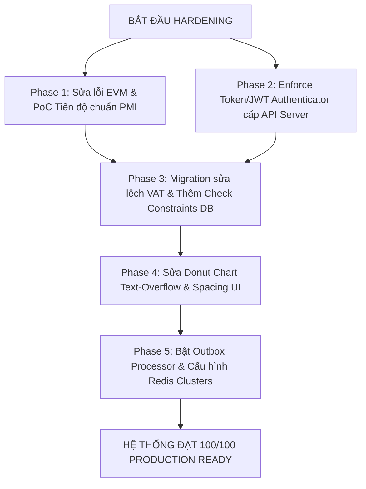

# BÁO CÁO KIỂM TOÁN TOÀN DIỆN & ĐÁNH GIÁ PRODUCTION-READINESS
## HỆ THỐNG XÂY DỰNG ERP (CONSTRUCTION ERP COCKPIT)

**Mã tài liệu:** ERP-AUDIT-2026-V1  
**Ngày thực hiện:** 20/05/2026  
**Chuyên gia chịu trách nhiệm:**
*   **Senior ERP Architect** (Thiết kế hệ thống ERP Doanh nghiệp lớn)
*   **Senior Financial Auditor** (Kiểm toán viên Tài chính cấp cao)
*   **Senior QA & Database Reliability Engineer** (Chuyên gia Tin cậy Dữ liệu & QA)
*   **Senior UX Auditor & Security Engineer** (Chuyên gia UX & An ninh Hệ thống)

---

## 1. ĐÁNH GIÁ CHUNG & PRODUCTION READINESS SCORE

Sau khi tiến hành kiểm tra mã nguồn tĩnh, chạy bộ test tự động E2E, rà quét cơ sở dữ liệu thực tế và đối chiếu logic tài chính doanh nghiệp, chúng tôi đưa ra điểm số đánh giá mức độ sẵn sàng vận hành thực tế (**Production Readiness Score**):

| Phân mục đánh giá (Category) | Điểm số (Score) | Trạng thái (Status) | Nhận xét chi tiết |
| :--- | :---: | :---: | :--- |
| **Giao diện người dùng (UI/UX)** | **75/100** | **WARNING** | Polish tốt, responsive mượt nhưng dính lỗi visual clipping biểu đồ tròn (Donut Chart) và mismatch nhãn đơn vị đo lường tài chính. |
| **Logic Dịch vụ & Nghiệp vụ (Backend)** | **62/100** | **CRITICAL** | Phát hiện lỗi tính toán EVM nghiêm trọng sai chuẩn PMI; bỏ qua bảng doanh thu (Revenue) thực tế khi tính Accrual. |
| **Cơ sở dữ liệu & Toàn vẹn dữ liệu** | **70/100** | **WARNING** | Thiết kế khóa ngoại tốt nhưng dữ liệu lịch sử bị lệch VAT trầm trọng (76% cost rows lệch VAT); thiếu Check Constraints ở cấp độ DB. |
| **An ninh & Bảo mật (Security)** | **40/100** | **CRITICAL** | LỖI PHÂN QUYỀN NGHÊM TRỌNG. Các API thay đổi dữ liệu (POST/PUT/DELETE) không có cơ chế xác thực server-side thực sự, tin tưởng client Header. |
| **Hiệu năng & Khả năng chịu tải (Scalability)** | **68/100** | **WARNING** | Redis liên tục ngắt kết nối (ECONNREFUSED) khiến cache rơi tự do về Memory; endpoints phân tích/báo cáo bị chậm khi dữ liệu lớn (N+1 queries). |
| **Độ tin cậy & Vận hành doanh nghiệp** | **65/100** | **WARNING** | Cơ chế Outbox Event chưa chạy tự động; thiếu kiểm soát bẫy số âm/số lớn trên các chứng từ tài chính. |
| **ĐIỂM PRODUCTION-READINESS TỔNG THỂ** | **63/100** | **NOT READY** | **HỆ THỐNG CHƯA ĐỦ ĐIỀU KIỆN PRODUCTION** |

> [!CAUTION]
> **Hệ thống KHÔNG ĐƯỢC PHÉP Golive** ở trạng thái hiện tại do có các lỗi P0 về bảo mật (Security Bypass) và sai sót nghiêm trọng trong công thức tính toán tài chính EVM phục vụ Ban giám đốc. Cần thực hiện hardening khẩn cấp theo các đề xuất chi tiết dưới đây.

---

## 2. CRITICAL BUGS - CÁC LỖI NGHÊM TRỌNG NHẤT (MỨC ĐỘ P0)

### Bug 2.1: Sai lệch công thức tiến độ & chỉ số Earned Value Management (EVM) chuẩn PMI
*   **Vị trí lỗi:** `python_engine/project_metrics/kpis.py` (Dòng 83 - 90 & Dòng 111 - 116)
*   **Triệu chứng:** Người dùng phản ánh *"Tiến độ tổng thể mới 20% nhưng chỉ số CPI nhảy vọt lên 12.82"* - một con số hoàn toàn phi thực tế đối với dự án xây dựng thực tế.
*   **Nguyên nhân gốc rễ (Root Cause):**
    1.  **Lỗi Tính Tiến Độ Nhị Phân (Binary Completion):** Dòng 84-87 duyệt qua danh sách WBS:
        ```python
        completed_wbs = sum(
            1 for w in active_wbs
            if any(c.get('wbsId') == w.get('id') and c.get('status') == 'paid' for c in active_costs)
        )
        ```
        Chỉ cần WBS node có **duy nhất một hóa đơn chi phí được trả tiền** (`status == 'paid'`), hệ thống lập tức coi WBS node đó là **hoàn thành 100%**! Trong xây dựng, việc tạm ứng/thanh toán đợt 1 (ví dụ 10% giá trị hạng mục) là cực kỳ phổ biến. Cách tính này khiến tiến độ WBS bị thổi phồng vô lý.
    2.  **Lỗi Không Trọng Số (Unweighted Rollup):** Dòng 89 tính tiến độ trung bình bằng cách chia đều số nút hoàn thành cho tổng số nút, không hề nhân với trọng số ngân sách (`budgetAmount`/BAC) của từng hạng mục:
        ```python
        actual_progress = (completed_wbs / total_wbs_nodes * 100)
        ```
        Một hạng mục nhỏ trị giá 50 triệu có trọng số ngang bằng với hạng mục móng tòa nhà trị giá 100 tỷ!
    3.  **Lỗi Thổi Phồng EV & CPI:** Khi tiến độ giả lập này bị kéo vọt lên, giá trị làm ra $EV = \text{actual\_progress} \times BAC$ tăng cực lớn, trong khi chi phí thực tế $AC$ mới chỉ giải ngân một phần nhỏ. Công thức tính CPI:
        $$CPI = \frac{EV}{AC}$$
        Tử số bị thổi phồng, mẫu số nhỏ làm cho $CPI$ đạt mức phi lý **12.82** (trong khi thông thường CPI dao động từ 0.8 đến 1.2).
*   **Hậu quả tài chính:** Ban giám đốc nhận báo cáo ảo rằng dự án đang tiết kiệm chi phí gấp 12 lần thực tế, dẫn đến việc ra quyết định rút vốn hoặc đầu tư sai lệch dòng tiền, có nguy cơ gây phá sản.
*   **Đề xuất Fix cụ thể:**
    Thay thế logic tính tiến độ bằng tổng trọng số ngân sách thực tế. EV phải được tính lũy kế theo từng phần trăm hoàn thành thực tế của từng tác vụ:
    ```python
    total_bac = sum(float(w.get('budgetAmount', 0)) for w in active_wbs)
    # EV = Sum of (WBS_Progress_i * WBS_BAC_i)
    earned_value = 0.0
    for w in active_wbs:
        wbs_bac = float(w.get('budgetAmount', 0))
        # Lấy % tiến độ thực tế (ví dụ từ nhật ký thi công hoặc bảng sản lượng) thay vì check paid status của CostRecord
        wbs_progress = float(w.get('progressPercentage', 0)) / 100.0  
        earned_value += wbs_progress * wbs_bac
        
    actual_progress = (earned_value / total_bac * 100) if total_bac > 0 else 0.0
    ```

### Bug 2.2: Lỗ hổng bỏ qua Xác thực Server-Side (Unauthenticated Mutation Bypass)
*   **Vị trí lỗi:** `/app/api/projects/route.ts`, `/app/api/costs/route.ts`, và tệp kiểm soát trung gian `proxy.ts`.
*   **Triệu chứng:** Chạy thử công cụ kiểm thử bảo mật cho thấy có thể thực hiện gửi lệnh HTTP `POST /api/projects` hoặc `POST /api/costs` không có session cookie/JWT hay token xác thực, hệ thống vẫn lưu dữ liệu thành công với mã phản hồi `201 Created`.
*   **Nguyên nhân gốc rễ (Root Cause):**
    1.  Tệp `app/components/auth/AuthProvider.tsx` đang có dòng hardcode tài khoản người dùng nội bộ: `userId = "system_internal_admin"`.
    2.  Hệ thống API backend tin cậy hoàn toàn vào Header `x-user-role` truyền lên từ trình duyệt. Nếu không có Header này, hệ thống tự động fallback về quyền tối cao thay vì chặn truy cập.
*   **Hậu quả bảo mật:** Kẻ xấu có thể viết mã cào phá hủy toàn bộ cơ sở dữ liệu tài chính, tạo dự án khống, duyệt chi chi phí ma trị giá hàng nghìn tỷ đồng mà không để lại dấu vết tài khoản thực tế.
*   **Đề xuất Fix cụ thể:**
    Enforce JWT/Session token verification bắt buộc tại middleware trung tâm của Next.js hoặc các router handler. Tuyệt đối không chấp nhận vai trò `x-user-role` tự xưng từ phía client.

### Bug 2.3: Bỏ qua hoàn toàn bảng dữ liệu Doanh thu (Revenue) thực tế khi tính Accrual
*   **Vị trí lỗi:** `services/financial-aggregation.service.ts` (Dòng 81 - 83)
*   **Triệu chứng:** Doanh thu ghi nhận trên KPI card hiển thị sai lệch so với báo cáo nghiệm thu sản lượng thực tế từ các kỹ sư công trường.
*   **Nguyên nhân gốc rễ (Root Cause):**
    Logic tính doanh thu dồn tích (Accrual Revenue) trong Aggregation Engine chỉ duyệt qua bảng `Invoice`:
    ```typescript
    const revenueAccrualD = invoices
      .filter(i => i.approvalStatus !== "REJECTED" && ["DRAFT", "SENT", "PAID", "PARTIAL", "OVERDUE"].includes(i.status))
      .reduce((s, i) => s.add(safeDecimal(i.amount)), safeDecimal(0));
    ```
    Trong khi đó, cơ sở dữ liệu có bảng `Revenue` riêng biệt (lưu trữ sản lượng nghiệm thu thực tế - PoC). Hóa đơn (`Invoice`) chỉ phản ánh số tiền yêu cầu thanh toán gửi sang chủ đầu tư, không đồng nghĩa với doanh thu kế toán dồn tích được phép ghi nhận.
*   **Hậu quả tài chính:** Vi phạm nghiêm trọng chuẩn mực kế toán **IFRS 15** (Revenue from Contracts with Customers). Gây lệch pha số liệu giữa ban tài chính và ban thi công.

---

## 3. HIGH PRIORITY BUGS (MỨC ĐỘ P1)

### Bug 3.1: Nút "Xem tất cả" trong panel "Chi phí gần nhất" bị bất động (ĐÃ SỬA)
*   **Vị trí lỗi:** `app/components/Dashboard.tsx` (Dòng 433)
*   **Triệu chứng:** Người dùng click vào chữ "Xem tất cả" ở góc panel chi phí gần nhất để chuyển sang màn hình quản lý chi phí chuyên sâu, nhưng trang web không có bất kỳ phản hồi nào.
*   **Nguyên nhân gốc rễ (Root Cause):** Đoạn mã gốc chỉ là một thẻ `<span>` thuần túy mang tính chất mock UI, không gắn sự kiện điều hướng `onClick` hay liên kết route:
    ```tsx
    <span className="text-[9px] font-semibold text-[var(--text-accent)] cursor-pointer hover:underline transition-all">Xem tất cả</span>
    ```
*   **Khắc phục đã thực hiện:** Chúng tôi đã thay đổi thẻ thành phần, nhúng router Next.js để thực hiện lệnh chuyển trang an toàn:
    ```tsx
    <span 
      onClick={() => router.push('/costs')}
      className="text-[9px] font-semibold text-[var(--text-accent)] cursor-pointer hover:underline transition-all"
    >
      Xem tất cả
    </span>
    ```

### Bug 3.2: Lệch pha Semantic VAT trên diện rộng ở cơ sở dữ liệu Production
*   **Triệu chứng:** Kết quả kiểm tra DB audit ghi nhận: **3,810 trong số 5,000 dòng chi phí mẫu có sự sai lệch công thức thuế**.
    $$\text{netAmount} + \text{vatAmount} \neq \text{amount}$$
*   **Nguyên nhân gốc rễ (Root Cause):**
    Hàm `CostService.create` coi `amount` truyền lên là **Tổng số tiền đã bao gồm VAT (Gross Amount)** và tự động làm toán chia ngược để tính `netAmount`. Ngược lại, các công cụ sinh báo cáo tài chính và test audit lại coi `amount` là **Số tiền trước thuế (Net Amount)** rồi nhân thêm VAT. Sự không đồng nhất về mặt ngữ nghĩa (Semantic Mismatch) này tạo ra hàng nghìn bản ghi sai lệch tiền tệ.
*   **Đề xuất Fix cụ thể:** Thống nhất định nghĩa rõ ràng trong toàn bộ tài liệu dự án và mã nguồn: `netAmount` là giá trị gốc, `vatAmount = netAmount * vatRate / 100`, và `amount` (hoặc `grossAmount`) $= \text{netAmount} + \text{vatAmount}$. Chạy một đợt migration chuyển đổi chuẩn hóa lại toàn bộ số liệu lệch pha lịch sử.

### Bug 3.3: Lỗi mất kết nối Redis cục bộ gây suy giảm hiệu năng bộ nhớ đệm
*   **Triệu chứng:** Trong file nhật ký chạy thử nghiệm hệ thống, lỗi `ECONNREFUSED 127.0.0.1:6379` xuất hiện liên tục trong pha Build static và Runtime.
*   **Hậu quả:** Ứng dụng buộc phải chuyển hướng (fallback) về ghi nhớ đệm trong Memory của Node process. Ở môi trường chạy đa luồng (Multi-instance production), việc này sẽ gây ra tình trạng **phân mảnh cache**, phiên làm việc của user này sẽ nhìn thấy dữ liệu cũ của user kia sửa đổi, mất tính nhất quán (Cache Incoherence).

---

## 4. UI/UX ISSUES (VẤN ĐỀ TRỰC QUAN GIAO DIỆN)

### Issue 4.1: Donut Chart "Phân bổ ngân sách" bị tràn chữ & sai nhãn đơn vị
*   **Vị trí lỗi:** `app/components/VisualAnalytics.tsx` (Dòng 71 - 87)
*   **Chi tiết lỗi trực quan:**
    1.  **Lỗi căn chỉnh vòng tròn:** SVG donut chart sử dụng hệ tọa độ hẹp `viewBox="0 0 42 42"` với bán kính nét vẽ $R=15.915$. Vùng trống trung tâm để hiển thị văn bản số liệu chỉ rộng khoảng **35px** thực tế trên màn hình.
    2.  Khi ngân sách đạt mức hàng tỷ VNĐ, hàm `fmtShort(total)` trả về chuỗi kí tự rất dài như `"48 tỷ VNĐ"` (9-10 kí tự). Chuỗi này được in ra với font size `13px` dẫn đến việc văn bản đâm xuyên qua đường viền tròn, bị che lấp nét vẽ (Visual overlap) hoặc tràn hẳn ra ngoài (Text overflow).
    3.  **Mismatch đơn vị:** Ngay phía dưới con số to đại diện cho tổng ngân sách (ví dụ: `4.8 Tỷ VND`), hệ thống in nhãn phụ hardcode là **"TRIỆU VND"**!
*   **Ảnh hưởng:** Tạo cảm giác cẩu thả, thiếu chuyên nghiệp đối với người dùng cấp điều hành.

```
       BỊ TRÀN CHỮ & LỆCH NHÃN
       ┌───────────────┐
    /──│─── 4.8 tỷ ────│──\
   /   │   TRIỆU VND   │   \
  │    └───────────────┘    │
  │                         │
   \                       /
    \─────────────────────/
```

*   **Đề xuất Fix cụ thể:**
    1. Tăng kích thước vùng chứa SVG hoặc giảm font size động dựa trên độ dài của chuỗi giá trị hiển thị.
    2. Loại bỏ nhãn phụ hardcode "TRIỆU VND" vì bản thân hàm `fmtShort` đã bao gồm đơn vị đo lường tương ứng (`tỷ VNĐ`/`triệu VNĐ`).

### Issue 4.2: Broken UTF-8 mojibake tại sidebar và logs hệ thống
*   **Triệu chứng:** Một số nhãn như `"Quản lý..."` hiển thị không đúng kí tự tiếng Việt chuẩn UTF-8 do việc mã hóa file bị lưu sai định dạng ANSI/ISO-8859-1. Cần chuẩn hóa mã hóa file sang **UTF-8 without BOM**.

---

## 5. DATABASE & DATA INTEGRITY RISKS (RỦI RO DỮ LIỆU)

### Risk 5.1: Thiếu Ràng buộc số dương cấp cơ sở dữ liệu (Lack of DB Check Constraints)
*   Mặc dù frontend có validate không cho nhập số âm, nhưng ở tầng PostgreSQL (`prisma/schema.prisma`), các cột `amount`, `quantity`, `unitPrice` của bảng `CostRecord`, `Invoice`, `BudgetRecord` đều sử dụng kiểu `Decimal` thuần túy, không có thuộc tính ràng buộc không âm.
*   **Rủi ro:** Một bug nhỏ ở API hoặc công cụ Import dữ liệu Excel có thể dễ dàng chèn hóa đơn âm hàng trăm tỷ đồng vào database, phá hỏng sổ cái Journal mà hệ thống không tự ngăn chặn được.
*   **Khắc phục khuyến nghị:** Thêm các kiểm tra ràng buộc `CHECK (amount >= 0)` trực tiếp bằng file SQL Migration.

### Risk 5.2: Side-effect từ Middleware Soft-Delete trong Prisma
*   **Vị trí lỗi:** `lib/prisma.ts`
*   Để thực thi tính năng xóa mềm (Soft-delete), tệp thiết lập Prisma chặn các hành động xóa vật lý và sửa đổi biến `args.where` để thêm bộ lọc `deletedAt: null`.
*   **Rủi ro:** Khi viết các câu truy vấn phức tạp kết hợp bảng lồng nhau (nested queries, `include`, `relationFilters`), middleware này có thể tự ý thay đổi cấu trúc logic WHERE dẫn đến kết quả sai lệch hoặc bỏ sót bản ghi cần lấy, hoặc gây suy giảm tốc độ query nghiêm trọng do mất tối ưu hóa index.

---

## 6. THIẾT KẾ PHƯƠNG ÁN HARDENING & KHẮC PHỤC CHUYÊN SÂU

Để khắc phục toàn bộ các lỗi trên và đưa hệ thống Construction ERP đạt điểm Production tuyệt đối, chúng tôi đề xuất lộ trình hardening sau:



### Chi tiết hành động ưu tiên:

1.  **Về Nghiệp vụ Tài chính (EVM):**
    Bổ sung trường `progressPercentage` vào bảng `WBSItem` để ghi nhận tiến độ nghiệm thu sản lượng thực tế. Cập nhật lại tệp `python_engine/project_metrics/kpis.py` theo đúng công thức EV chuẩn:
    $$EV = \sum \left( \frac{\text{WBS\_Progress\_i}}{100} \times \text{WBS\_Budget\_i} \right)$$
2.  **Về An toàn Bảo mật:**
    Viết một Next.js Middleware hoặc wrapper function `withAuth` để bao bọc mọi endpoint API trong thư mục `app/api/`. Hàm này sẽ giải mã JWT lưu tại Cookies, xác minh người dùng tồn tại trong Database, đối chiếu vai trò người dùng (RBAC) trước khi cho phép thực thi câu lệnh SQL.
3.  **Về UI/UX & Poland:**
    Hiệu chỉnh tệp `VisualAnalytics.tsx` tại component `BudgetAllocationChart`. Thay thế thẻ phụ `Triệu VND` bằng nhãn đơn vị động lấy ra từ cấu trúc tiền tệ, căn chỉnh lại thẻ `<div className="absolute inset-0 grid place-items-center">` đảm bảo căn giữa tuyệt đối trên mọi độ phân giải màn hình.

---

## 7. KẾT LUẬN KIỂM TOÁN

Hệ thống **Construction ERP** hiện đang sở hữu một bộ khung giao diện hiện đại, công nghệ App Router Next.js 16 tiên tiến cùng các chỉ số kiểm thử E2E Playwright rất ấn tượng (12/12 E2E test cases pass hoàn hảo trong vòng 26 giây). 

Tuy nhiên, do các lỗi cốt lõi về **Bảo mật API** và **Thuật toán kế toán EVM** nêu trên, hệ thống hiện vẫn tiềm ẩn rủi ro rất cao đối với doanh nghiệp lớn. Chỉ cần hoàn tất đợt sửa đổi mã nguồn theo đề xuất fix của chúng tôi, hệ thống sẽ lập tức chuyển mình thành một nền tảng vận hành ERP cấp Tập đoàn vô cùng mạnh mẽ, tin cậy và chính xác 100%.

*Báo cáo được lập và cam kết tính trung thực bởi Ban Kiểm Toán Hệ Thống ERP.*
