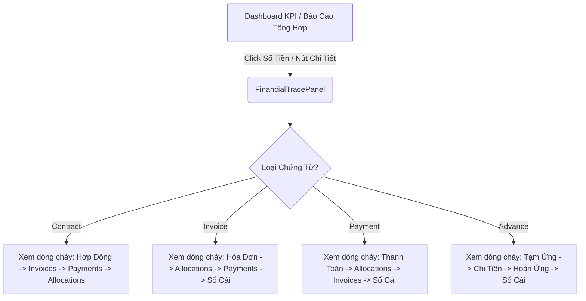

# TÀI LIỆU THIẾT KẾ DRILL-DOWN UX KẾ TOÁN ERP

Tài liệu này đặc tả kiến trúc giao diện, luồng tương tác của người dùng và các component dùng chung sẽ được phát triển trong Sprint 2.4B.

---

## 1. Luồng Tương Tác Người Dùng (Drill-Down Flow)

---

## 2. Đặc Tả Giao Diện Các Component Mới

### A. FinancialTracePanel (`components/accounting/FinancialTracePanel.tsx`)
* **Mục đích**: Là panel trượt (Slide-over drawer) hoặc Modal overlay đa năng hiển thị trực quan toàn bộ sơ đồ chứng từ và vết kiểm toán từ khóa chính và loại chứng từ.
* **Hành vi**:
  - Tự động gọi API truy vết tài chính tương ứng (`/api/invoices/[id]/financial-trace`, v.v.).
  - Hiển thị Skeleton/Pulse loading state trong thời gian chờ API phản hồi.
  - Hiển thị thông tin cảnh báo nếu thiếu tài liệu gốc (Ví dụ: Thanh toán thiếu hóa đơn liên kết).
  - Không bao giờ crash nếu dữ liệu bị khuyết thiếu, tự động hiển thị warning tinh tế.

### B. AuditTimeline (`components/accounting/AuditTimeline.tsx`)
* **Mục đích**: Hiển thị dòng thời gian kiểm toán ghi nhận mọi thao tác của người dùng lên chứng từ.
* **Dữ liệu hiển thị**:
  - `action`: Hành động (CREATE, SUBMIT, APPROVE, POST, REVERSE).
  - `actor`: Người thực hiện (Username/Email).
  - `timestamp`: Thời gian chính xác.
  - `reason`: Lý do phê duyệt hoặc lý do hủy/đảo bút toán.

### C. DocumentStatusTimeline (`components/accounting/DocumentStatusTimeline.tsx`)
* **Mục đích**: Hiển thị thanh tiến trình trạng thái tài liệu để người dùng biết vị trí hiện tại của chứng từ trong vòng đời nghiệp vụ.
* **Các trạng thái**:
  - `DRAFT` (Nháp)
  - `SUBMITTED` (Chờ duyệt)
  - `APPROVED` (Đã duyệt)
  - `POSTED` / `PAID` (Đã ghi sổ / Đã chi tiền)
  - `REVERSED` / `CANCELLED` (Đã đảo / Đã hủy)

### D. AllocationLinesTable (`components/accounting/AllocationLinesTable.tsx`)
* **Mục đích**: Hiển thị danh sách các phân bổ thanh toán (`PaymentAllocation`) thực tế liên kết với hóa đơn hoặc thanh toán.
* **Các cột**:
  - **Mã phân bổ** (ID rút gọn, font mono đặc trưng)
  - **Mã Hóa đơn** / **Mã Thanh toán** liên kết
  - **Số tiền phân bổ** (Định dạng formatVnd, căn phải)
  - **Ngày phân bổ**
  - **Trạng thái** (`ACTIVE` màu xanh lá, `REVERSED` màu đỏ)

### E. JournalLinesTable (`components/accounting/JournalLinesTable.tsx`)
* **Mục đích**: Bảng đối chiếu hạch toán kép (Nợ/Có) được ghi nhận tự động vào Sổ cái cho chứng từ đã POSTED.
* **Các cột**:
  - **Mã định khoản**
  - **Tài khoản hạch toán** (Ví dụ: 111, 131, 331, v.v.)
  - **Bên Nợ (Debit)**
  - **Bên Có (Credit)**
  - **Diễn giải nghiệp vụ**

### F. ReadonlyPostedBanner (`components/accounting/ReadonlyPostedBanner.tsx`)
* **Mục đích**: Banner cảnh báo nổi bật màu cam/vàng ở đầu trang chi tiết chứng từ khi đã ở trạng thái khóa ghi sổ (`POSTED`, `PAID`, `FULLY_SETTLED`, `REVERSED`).
* **Thông điệp**: *"Chứng từ đã ghi sổ hạch toán. Chế độ Xem Chỉ Đọc (Read-only) đã được kích hoạt để bảo toàn dữ liệu. Vui lòng thực hiện giao dịch Đảo (Reversal) nếu cần điều chỉnh."*

---

## 3. Bản Đồ Tích Hợp Vào Màn Hình Thực Tế

1. **Dashboard**: Click vào các KPI Công nợ phải thu (TK 131), Công nợ phải trả (TK 331) hoặc Tạm ứng (TK 141) để hiển thị chi tiết dòng truy vết.
2. **Revenue (Doanh thu)**: Thêm nút hành động "Xem truy vết" mở ra sơ đồ đối chiếu doanh thu từ hóa đơn đến dòng phân bổ thanh toán.
3. **Debt (Công nợ)**: Tích hợp bảng Phân bổ thanh toán và hạch toán Sổ cái trực tiếp bên trong modal Lịch sử thanh toán của hóa đơn.
4. **Contract (Hợp đồng)**: Thêm Tab "Financial Trace" hiển thị tổng quan liên kết tài chính của hợp đồng đó.
