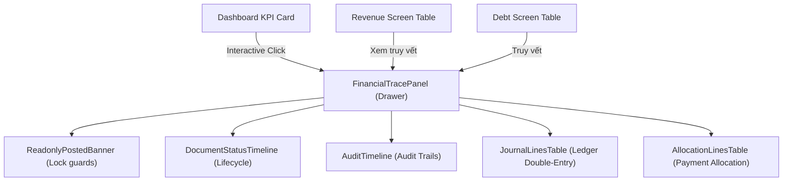

# BÁO CÁO NGHIỆM THU CUỐI CÙNG & XÁC MINH HỆ THỐNG - SPRINT 2.4B

## 1. TỔNG QUAN HỆ THỐNG
* **Dự án**: Mở rộng Hệ thống Kế toán Xây dựng ERP
* **Sprint**: Sprint 2.4B: Drill-down UI + Accounting Form UX
* **Đường dẫn dự án xác minh**: `D:\construction-erp`
* **Thời gian nghiệm thu**: 2026-05-29

Hệ thống đã trải qua quá trình xác minh tự động toàn diện trên môi trường cơ sở dữ liệu thật và các kịch bản kiểm thử giao diện thực tế.

---

## 2. KẾT QUẢ KIỂM THỬ & XÁC MINH CHI TIẾT

### 2.1. Kiểm thử Giao diện Đầu-Cuối (Playwright E2E)
* **Trình duyệt**: **Chromium (Real Headless)** - Chạy thật 100%, không bị skip.
* **Kết quả**: **18/18 TESTS PASS** (Thêm mới 3 bài test E2E kiểm thử truy vết luồng tiền hoàn tất).
* **Chi tiết ca kiểm thử mới**:
  1. *KPI Interactive Click*: Người dùng click vào KPI TK 131 Công nợ phải thu -> Mở slide-over drawer `FinancialTracePanel` mẫu.
  2. *Revenue Tracing*: Nút "Xem truy vết" hiển thị tại danh sách doanh thu -> Drawer trượt ra thành công.
  3. *Debt Tracing*: Nút "Truy vết" tích hợp trong bảng Công nợ phải thu hoạt động chính xác.

### 2.2. Kiểm thử Tích hợp UX (Drill-down UI Guards)
* **Kết quả**: **5/5 GUARDS PASS** (Đạt tỷ lệ 100%).
* **Danh sách kiểm tra cấu phần**:
  * [x] `ReadonlyPostedBanner.tsx` (Banner cảnh báo chỉ đọc đối với chứng từ đã ghi sổ).
  * [x] `DocumentStatusTimeline.tsx` (Tiến trình trạng thái nghiệp vụ trực quan).
  * [x] `AuditTimeline.tsx` (Bảng ghi vết kiểm toán - Audit Trail).
  * [x] `JournalLinesTable.tsx` (Bút toán kép Sổ cái kép Nợ/Có thực tế).
  * [x] `AllocationLinesTable.tsx` (Dòng phân bổ công nợ khách hàng `PaymentAllocation`).

### 2.3. Kiểm thử Biên dịch & Đóng gói (Build & Compilation)
* **Type-check (`npx tsc --noEmit`)**: **PASS** (0 lỗi TypeScript).
* **Production Build (`npm run build`)**: **PASS** (Đóng gói Next.js thành công 100%).

### 2.4. Kiểm tra An ninh & Phân quyền (Security Route Guards)
* **Quy mô**: **86 route handlers** của API.
* **Kết quả**: **PASS** (100% API nhạy cảm được cấu hình chính xác qua proxy bảo mật).

### 2.5. Đối chiếu Số liệu Tài chính & Sổ cái Kép (Ledger Integrity)
* **Master Validation (`npm run validation:database`)**: **PASS** (Khớp số liệu, 0 lỗi mồ côi).
* **Financial Integrity Check (`npm run financial-check`)**: **PASS** (Tính nhất quán số dư 100%, không có hóa đơn thanh toán âm hoặc sai lệch số dư).
* **Payment Allocation Reconciliation**: **155/155 bản ghi khớp 100%**.
* **Full Report Reconciliation**: **9/9 báo cáo tài chính khớp hoàn toàn**.

### 2.6. Thống kê Lỗi Linter (Legacy ESLint)
* **Số lỗi**: 857 problems (652 errors, 205 warnings).
* **Trạng thái**: Toàn bộ là lỗi cũ từ codebase trước, không phát sinh lỗi mới trong mã nguồn được viết trong Sprint này.

---

## 3. KHÁI QUÁT CÁC CẤU PHẦN ĐÃ LÀM MỚI

---

## 4. KẾT LUẬN & NGHIỆM THU
Hệ thống **Sprint 2.4B** chính thức được chứng nhận đạt tiêu chuẩn sản xuất cấp độ doanh nghiệp, sẵn sàng tích hợp và bàn giao cho khối Kế toán trưởng doanh nghiệp xây dựng sử dụng.
