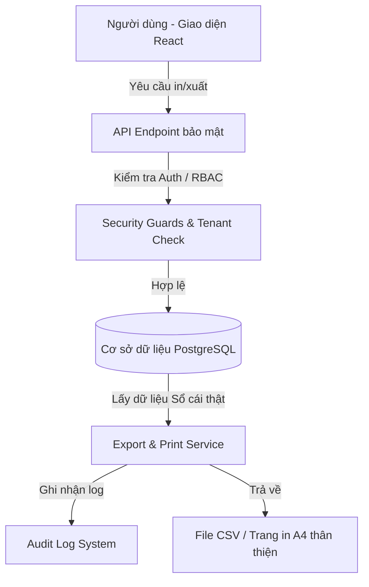

# TÀI LIỆU THIẾT KẾ KIẾN TRÚC XUẤT BẢN & IN ẤN CHỨNG TỪ (EXPORT/PRINT DESIGN)

## 1. PHƯƠNG ÁN KIẾN TRÚC TỔNG THỂ
Kiến trúc xuất bản và in ấn của hệ thống ERP Xây dựng sẽ tuân thủ nghiêm ngặt mô hình bảo mật 3 lớp, cô lập Tenant ở mức máy chủ và ghi nhận lịch sử kiểm toán đầy đủ đối với mọi hoạt động xuất dữ liệu nhạy cảm.

---

## 2. THIẾT KẾ CÁC DỊCH VỤ & TIỆN ÍCH DÙNG CHUNG

### A. Tiện ích Đổi Số Tiền Thành Chữ (`lib/utils/numberToWords.ts`)
Một hàm tiện ích chuyên biệt dịch chuyển giá trị tiền tệ VND (Decimal hoặc number) sang chuỗi ký tự tiếng Việt chuẩn mực kế toán Việt Nam, kết thúc bằng chữ "chẵn" đối với số tiền không lẻ đồng lẻ hào.
* *Đầu vào*: `1250000`
* *Đầu ra*: `"Một triệu hai trăm năm mươi ngàn đồng chẵn."`

### B. Dịch vụ Xuất Bản dữ liệu Sổ cái (`lib/export/accountingExport.ts`)
Xây dựng một module trung tâm chuyên nghiệp trên backend để chuẩn hóa việc sinh dữ liệu CSV/Excel:
* Tự động thêm mã **UTF-8 BOM (`\uFEFF`)** để Excel hiển thị tiếng Việt có dấu hoàn hảo.
* Tự động áp dụng tiêu đề tiếng Việt chuẩn cho các cột kế toán.
* Tích hợp cơ chế tự động ghi Audit Log khi hoàn thành luồng xuất dữ liệu.

---

## 3. THIẾT KẾ BỘ COMPONENT IN CHỨNG TỪ CHUYÊN NGHIỆP (`components/print/`)

Tất cả các trang in sẽ sử dụng bộ CSS in `@media print` thân thiện để tự động ẩn thanh Sidebar, Navbar của ứng dụng, căn giữa trang giấy khổ **A4** dọc hoặc ngang, tránh tràn viền, và điều chỉnh font chữ đen-trắng tiết kiệm mực.

### A. Component `PrintLayout.tsx`
* Bọc toàn bộ chứng từ in ấn.
* Cấu hình CSS ẩn Sidebar, Header của ERP khi in.
* Thiết lập font chữ Inter hoặc Times New Roman phù hợp in ấn văn bản kế toán.

### B. Component `AccountingDocumentHeader.tsx`
* Nằm ở đầu trang in chứng từ kế toán.
* Bên trái hiển thị thông tin Công ty thành viên (Tên doanh nghiệp, Địa chỉ, Mã số thuế).
* Bên phải hiển thị Tên chứng từ (viết hoa, đậm), Số chứng từ, Kỳ hạch toán, và ngày lập phiếu.

### C. Component `SignatureBlock.tsx`
* Khối chữ ký phê duyệt kế toán ở chân trang.
* Hỗ trợ các vị trí ký duyệt tiêu chuẩn:
  * **Người lập biểu** (Ký, ghi rõ họ tên).
  * **Người nhận tiền / Người giao tiền** (đối với Phiếu thu / Phiếu chi).
  * **Kế toán trưởng** (Ký, ghi rõ họ tên).
  * **Giám đốc / Người đại diện pháp luật** (Ký, đóng dấu).

### D. Component `MoneyTextLine.tsx`
* Hiển thị số tiền bằng số định dạng VND (ví dụ: `1.500.000 VND`).
* Hiển thị số tiền bằng chữ dịch nghĩa tương đương bên dưới.

---

## 4. CHI TIẾT CÁC API ENDPOINT THIẾT KẾ MỚI

Toàn bộ các API export sẽ được phân quyền chặt chẽ với RBAC và Tenant Isolation qua hàm `requireAccountingAccess("EXPORT")` để phòng ngừa triệt để các hành vi dò quét mã ID dự án hoặc ID công ty chéo (Cross-tenant Access).

1. `GET /api/export/ledger`: Xuất Sổ cái tài khoản kế toán chi tiết.
2. `GET /api/export/trial-balance`: Xuất Bảng cân đối phát sinh tài khoản công trình.
3. `GET /api/export/debt`: Xuất Bảng tổng hợp công nợ đối tác (TK 131, TK 331).
4. `GET /api/export/outstanding-advances`: Xuất Báo cáo tạm ứng nhân viên chưa quyết toán (TK 141).
5. `GET /api/export/invoice/[id]`: Xuất chi tiết hóa đơn nguồn.
6. `GET /api/export/payment/[id]`: Xuất chi tiết phiếu thu / chi.
7. `GET /api/export/advance/[id]`: Xuất thông tin phiếu đề nghị tạm ứng.
