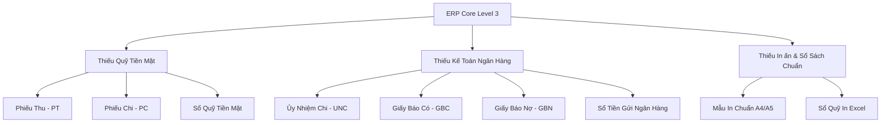

# AUDIT HIỆN TRẠNG PHÂN HỆ QUỸ / NGÂN HÀNG (SỐ LIỆU & NGHIỆP VỤ)

**Ngày lập:** 2026-05-29  
**Người thực hiện:** Senior Software Architect & Senior Accounting ERP Developer  
**Hệ thống:** Construction ERP  
**Đường dẫn dự án:** `D:\construction-erp`  

---

## 1. TIỀN MẶT / QUỸ

| Nghiệp vụ / Thuộc tính | Hiện trạng | Thiếu gì | Mức độ | Đề xuất |
|---|---|---|---|---|
| **Phiếu thu (Cash Receipt)** | ❌ Chưa có | Chưa có model, màn hình UI nhập liệu, hay API tạo và quản lý Phiếu thu. | **CRITICAL** | Tạo model `CashBankDocument` với type `CASH_RECEIPT` và UI màn hình lập phiếu. |
| **Phiếu chi (Cash Payment)** | ❌ Chưa có | Chưa có model, màn hình UI lập phiếu chi chi tiền mặt. | **CRITICAL** | Tạo type `CASH_PAYMENT` trong `CashBankDocument` phục vụ chi thanh toán nhà cung cấp/tạm ứng. |
| **Sổ quỹ tiền mặt (Cash Book)** | ❌ Chưa có | Chưa có bảng tổng hợp thu chi tồn quỹ tiền mặt lọc theo TK 111. | **HIGH** | Thêm API/UI kết xuất sổ quỹ lấy từ các chứng từ tiền mặt đã `POSTED`. |
| **Tài khoản 111 (TK Tiền mặt)** | ✅ Đã có | Đã có tài khoản tiền mặt trong Chart of Accounts (`LedgerAccount` code "1110" hoặc "111"). | **None** | Sử dụng làm tài khoản Nợ/Có mặc định cho tiền mặt. |
| **Định khoản Nợ/Có tiền mặt** | ✅ Có thông qua JournalEntry | Chưa có cơ chế định khoản tự động khi lập Phiếu thu/chi (Dr 111/Cr 131, Dr 141/Cr 111...). | **HIGH** | Tự động sinh `JournalEntry` hạch toán cân đối khi `POST` phiếu thu/chi. |
| **Đối tượng nộp/nhận tiền** | ❌ Chưa có trường rõ ràng | Chưa có trường lưu trữ tên đối tượng nộp/nhận (khách hàng, nhân viên, nhà cung cấp) trên chứng từ gốc. | **HIGH** | Bổ sung trường `partnerName` và liên kết `User` / `Supplier` nếu cần. |
| **Lý do thu/chi** | ❌ Chỉ có description chung | Thiếu lý do thu/chi chuẩn hóa kế toán Việt Nam. | **Medium** | Thêm trường `description` lưu lý do nộp/nhận tiền. |
| **Mẫu in Phiếu thu/chi** | ❌ Chưa có | Chưa có trang in mẫu phiếu thu/chi chuẩn Việt Nam. | **HIGH** | Thiết lập trang in `/print/cash-receipt/[id]` và `/print/cash-payment/[id]`. |
| **Số chứng từ tự động** | ❌ Chỉ có Voucher Ref | Thiếu sinh số tự động theo định dạng `PT-YYYYMM-XXXX` và `PC-YYYYMM-XXXX`. | **HIGH** | Sử dụng `VoucherNumberService` tự động cấp số cho Cash/Bank documents. |

---

## 2. NGÂN HÀNG / TIỀN GỬI

| Nghiệp vụ / Thuộc tính | Hiện trạng | Thiếu gì | Mức độ | Đề xuất |
|---|---|---|---|---|
| **Ủy nhiệm chi (Bank Transfer)** | ❌ Chưa có | Chưa có form UI, model lưu trữ và API hạch toán ủy nhiệm chi. | **CRITICAL** | Tạo type `BANK_TRANSFER` hạch toán Dr 331/141... / Cr 1120. |
| **Giấy báo Có (Credit Notice)** | ❌ Chưa có | Chưa có form ghi nhận báo Có ngân hàng (thu tiền KH). | **HIGH** | Tạo type `BANK_CREDIT_NOTICE` hạch toán Dr 1120 / Cr 131... |
| **Giấy báo Nợ (Debit Notice)** | ❌ Chưa có | Chưa có form ghi nhận báo Nợ ngân hàng (phí ngân hàng). | **HIGH** | Tạo type `BANK_DEBIT_NOTICE` hạch toán Dr 642/635 / Cr 1120. |
| **Sổ tiền gửi ngân hàng (Bank Book)** | ❌ Chưa có | Chưa có bảng tổng hợp dòng tiền ngân hàng theo TK 112. | **HIGH** | Thêm API/UI kết xuất Sổ tiền gửi ngân hàng từ các chứng từ ngân hàng đã `POSTED`. |
| **Tài khoản 112 (TK Tiền gửi)** | ✅ Đã có | Đã có tài khoản tiền gửi ngân hàng trong Chart of Accounts ("1120" hoặc "112"). | **None** | Sử dụng làm tài khoản Nợ/Có mặc định cho tiền gửi. |
| **Thông tin tài khoản NH** | ⚠️ Cơ bản | Chưa liên kết trực tiếp tài khoản ngân hàng cụ thể của công ty với chứng từ. | **Medium** | Tận dụng BankAccount model có sẵn trong DB để liên kết. |
| **Mẫu in Ủy nhiệm chi** | ❌ Chưa có | Chưa có trang in UNC A4 chuẩn cho kế toán. | **HIGH** | Lập trang in `/print/bank-transfer/[id]`. |

---

## 3. LIÊN KẾT VỚI CÁC PHÂN HỆ ĐÃ CÓ

| Module liên kết | Tình trạng liên kết hiện tại | Đề xuất tích hợp trong Sprint 3.1 |
|---|---|---|
| **Payment (AR)** | Lưu phiếu thu khách hàng chung. | CashBankDocument thu tiền KH (`CASH_RECEIPT`, `BANK_CREDIT_NOTICE`) có thể sinh `PaymentAllocation` đối soát hóa đơn. |
| **Invoice (AR)** | Chỉ theo dõi công nợ `remainingAmount`. | Khi post Giấy báo Có / Phiếu thu, tự động khấu trừ công nợ hóa đơn đầu ra. |
| **AdvanceRequest** | Vòng đời tạm ứng đã có PAID. | Post phiếu chi/UNC tạm ứng sẽ chuyển trạng thái Advance sang `PAID` và ghi nhận `paidAmount`. |
| **AdvanceSettlement** | Vòng đời quyết toán hoàn ứng. | Thu hoàn ứng thừa bằng tiền mặt (Phiếu thu) chuyển Settlement sang `POSTED` và ghi nhận thu tiền. |
| **CostRecord (AP)** | Chi phí công trình `status` unpaid/paid. | Chi tiền trả NCC bằng Phiếu chi/UNC sẽ chuyển trạng thái Cost sang `paid`. |
| **General Ledger & Journal** | Định khoản thủ công / Posting engine. | Lập phiếu cash/bank sẽ tự động sinh `JournalEntry` và `TransactionLines` cân Nợ/Có khi chốt sổ ghi sổ (`POSTED`). |
| **Approval Inbox** | Chỉ hiển thị Invoice/Cost/Advance/Settlement. | Bổ sung `CashBankDocument` trạng thái `SUBMITTED` vào danh sách chờ duyệt của kế toán trưởng. |
| **Financial Trace** | Hỗ trợ drill-down hóa đơn/chi phí. | Drill-down từ báo cáo dòng tiền vào thẳng chứng từ cash/bank gốc, xem được audit trail và sổ cái tương ứng. |
| **Management Reports / Cashflow** | Tính toán dòng tiền từ Payments/Cost. | Bổ sung nguồn tiền thu/chi thực tế từ các chứng từ cash/bank đã post vào báo cáo dòng tiền Cashflow ròng. |

---

## 4. BẢNG TỔNG HỢP AUDIT GAP ANALYSIS

### Đánh giá mức độ thiếu hụt phân hệ Quỹ / Ngân hàng:
* **Mức độ ảnh hưởng:** **Rất cao (Blocker cho Pilot thực tế).** Kế toán viên không thể nhập liệu thu/chi hàng ngày vì không có form lập Phiếu thu/chi chuyên biệt. Việc dùng chung Sổ nhật ký chung (Journal Voucher) để nhập thu chi gây quá tải và dễ sai sót tài khoản tiền (111, 112).
* **Đề xuất:** Cần xây dựng ngay một bảng cấu trúc dữ liệu `CashBankDocument` thống nhất, quản lý trọn vẹn cả 5 loại chứng từ tiền, đảm bảo nghiệp vụ hạch toán kép an toàn và cơ chế in ấn, chốt sổ chéo chặt chẽ.
