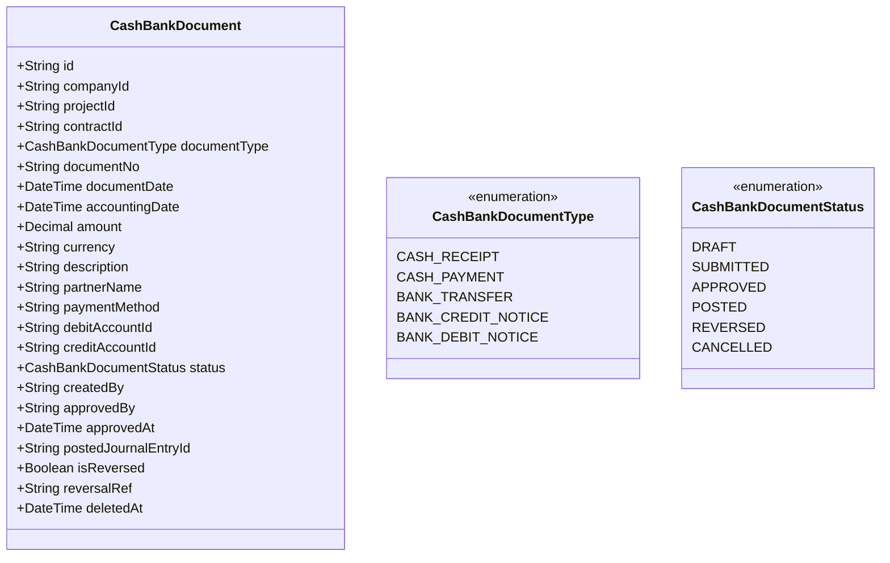
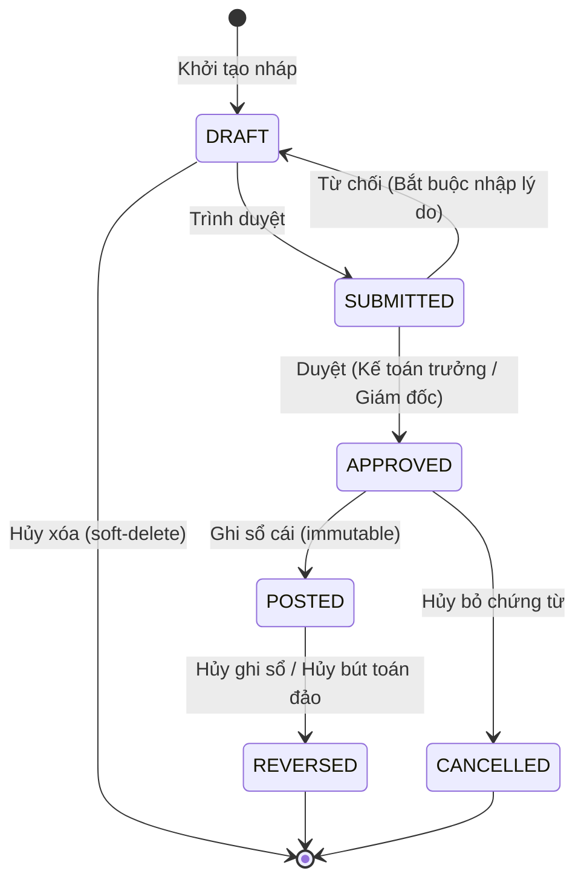

# THIẾT KẾ KỸ THUẬT PHÂN HỆ CHỨNG TỪ QUỸ / NGÂN HÀNG
## SPRINT 3.1 — VIETNAMESE CASH/BANK DOCUMENTS: PHIẾU THU / PHIẾU CHI / ỦY NHIỆM CHI / SỔ QUỸ / SỔ NGÂN HÀNG

**Ngày lập:** 2026-05-29  
**Người lập:** Senior Software Architect & Senior Accounting ERP Developer  
**Hệ thống:** Construction ERP  
**Đường dẫn dự án:** `D:\construction-erp`  

---

## 1. DATA MODEL DESIGN (CẤU TRÚC DỮ LIỆU)

Để đảm bảo tính nhất quán và đơn giản hóa việc bảo trì cơ sở dữ liệu, toàn bộ 5 loại chứng từ tiền mặt và tiền gửi ngân hàng sẽ được lưu trữ trong một bảng duy nhất mang tên `CashBankDocument`.



### Cấu trúc thực tế trong schema.prisma:
```prisma
enum CashBankDocumentType {
  CASH_RECEIPT
  CASH_PAYMENT
  BANK_TRANSFER
  BANK_CREDIT_NOTICE
  BANK_DEBIT_NOTICE
}

enum CashBankDocumentStatus {
  DRAFT
  SUBMITTED
  APPROVED
  POSTED
  REVERSED
  CANCELLED
}

model CashBankDocument {
  id                   String                 @id @default(uuid())
  companyId            String
  projectId            String?
  contractId           String?
  documentType         CashBankDocumentType
  documentNo           String
  documentDate         DateTime               @default(now())
  accountingDate       DateTime               @default(now())
  amount               Decimal                @db.Decimal(18, 2)
  currency             String                 @default("VND")
  description          String
  partnerName          String?
  paymentMethod        String                 // CASH, BANK
  debitAccountId       String
  creditAccountId      String
  status               CashBankDocumentStatus @default(DRAFT)
  createdBy            String
  approvedBy           String?
  approvedAt           DateTime?
  postedJournalEntryId String?
  isReversed           Boolean                @default(false)
  reversalRef          String?
  deletedAt            DateTime?
  createdAt            DateTime               @default(now())
  updatedAt            DateTime               @updatedAt

  company              Company                @relation(fields: [companyId], references: [id])
  project              Project?               @relation(fields: [projectId], references: [id])
  contract             Contract?              @relation(fields: [contractId], references: [id])
  debitAccount         LedgerAccount          @relation("DebitAccount", fields: [debitAccountId], references: [id])
  creditAccount        LedgerAccount          @relation("CreditAccount", fields: [creditAccountId], references: [id])

  @@unique([companyId, documentType, documentNo, deletedAt])
  @@index([companyId])
  @@index([projectId])
  @@index([documentType])
  @@index([status])
}
```

*Quan hệ bổ sung trên model `LedgerAccount`:*
```prisma
  debitCashDocuments  CashBankDocument[] @relation("DebitAccount")
  creditCashDocuments CashBankDocument[] @relation("CreditAccount")
```

---

## 2. LIFECYCLE MANAGEMENT (VÒNG ĐỜI CHỨNG TỪ)

Vòng đời của tệp tin chứng từ tiền mặt & ngân hàng tuân thủ nghiêm ngặt chuẩn **Level 3 Accounting Safeguards**:



### Quy tắc kiểm soát bắt buộc (Hard-coded safety guards):
1. **DRAFT:** Cho phép cập nhật đầy đủ các trường thông tin (Số tiền, tài khoản Nợ/Có, lý do...).
2. **SUBMITTED:** Chờ duyệt trong Approval Inbox, đóng băng giao diện sửa trực tiếp.
3. **APPROVED:** Cho phép ghi sổ cái (`POSTED`). Không được phép sửa trực tiếp.
4. **POSTED:** **BẤT BIẾN (IMMUTABLE).** Không được sửa, không được xóa trực tiếp trong DB. Chỉ cho phép thực hiện thao tác **Đảo bút toán (Reverse)** tạo bút toán đối ứng âm hoặc đảo ngược Nợ/Có.
5. **Kỳ khóa sổ (Fiscal Period Lock):** Toàn bộ các thao tác (Tạo mới, Sửa, Duyệt, Ghi sổ, Đảo bút toán) thuộc kỳ đã khóa đều bị chặn đứng bởi `assertPeriodNotLocked`.
6. **Bất kiêm nhiệm (Segregation of Duties - SoD):** Người lập phiếu (`createdBy`) tuyệt đối không được tự duyệt phiếu của mình (`approvedBy !== createdBy`).
7. **Lý do từ chối:** Từ chối (`REJECT`) bắt buộc có tham số lý do dài tối thiểu 5 ký tự để ghi nhật ký audit trail.

---

## 3. POSTING RULES (NGUYÊN TẮC HẠCH TOÁN KÉP)

Khi chứng từ chuyển trạng thái sang `POSTED` (Ghi sổ cái), một `JournalEntry` tương ứng sẽ được tự động tạo lập thông qua `PostingEngine` với nguyên tắc hạch toán:

| Loại chứng từ (`documentType`) | Nghiệp vụ điển hình | Tài khoản Nợ (`debitAccount`) | Tài khoản Có (`creditAccount`) | Số tiền | Bút toán Sổ Cái tương ứng |
|---|---|---|---|---|---|
| **CASH_RECEIPT (Phiếu thu)** | Thu tiền khách hàng trả nợ | 111 (Tiền mặt) | 131 (Phải thu KH) | `amount` | Dr 111 / Cr 131 |
| | Hoàn ứng tạm ứng nhân viên | 111 (Tiền mặt) | 141 (Tạm ứng NV) | `amount` | Dr 111 / Cr 141 |
| | Thu tiền khác | 111 (Tiền mặt) | Tài khoản được chọn | `amount` | Dr 111 / Cr TK chọn |
| **CASH_PAYMENT (Phiếu chi)** | Chi trả nhà cung cấp vật tư | 331 (Phải trả NCC) | 111 (Tiền mặt) | `amount` | Dr 331 / Cr 111 |
| | Chi tạm ứng nhân viên mua hàng | 141 (Tạm ứng NV) | 111 (Tiền mặt) | `amount` | Dr 141 / Cr 111 |
| | Chi phí trực tiếp bằng tiền mặt | 621/622/627... | 111 (Tiền mặt) | `amount` | Dr 62x / Cr 111 |
| **BANK_TRANSFER (Ủy nhiệm chi)**| Chuyển khoản trả NCC/nhà thầu | 331 (Phải trả NCC) | 112 (Tiền gửi NH) | `amount` | Dr 331 / Cr 112 |
| | Chuyển khoản tạm ứng nhân viên | 141 (Tạm ứng NV) | 112 (Tiền gửi NH) | `amount` | Dr 141 / Cr 112 |
| **BANK_CREDIT_NOTICE (Báo Có)**| Khách hàng chuyển khoản trả nợ | 112 (Tiền gửi NH) | 131 (Phải thu KH) | `amount` | Dr 112 / Cr 131 |
| **BANK_DEBIT_NOTICE (Báo Nợ)** | Ngân hàng trừ phí quản lý TK | 642 (CPQLDN) | 112 (Tiền gửi NH) | `amount` | Dr 642 / Cr 112 |

---

## 4. NUMBERING CONVENTIONS (QUY TẮC ĐÁNH SỐ CHỨNG TỰ ĐỘNG)

Số chứng từ tiền mặt & ngân hàng được sinh tự động theo mẫu để tránh trùng lặp và dễ quản lý:
* **Phiếu thu:** `PT-YYYYMM-XXXX` (Ví dụ: `PT-202605-0001`)
* **Phiếu chi:** `PC-YYYYMM-XXXX` (Ví dụ: `PC-202605-0001`)
* **Ủy nhiệm chi:** `UNC-YYYYMM-XXXX` (Ví dụ: `UNC-202605-0001`)
* **Giấy báo Có:** `GBC-YYYYMM-XXXX` (Ví dụ: `GBC-202605-0001`)
* **Giấy báo Nợ:** `GBN-YYYYMM-XXXX` (Ví dụ: `GBN-202605-0001`)

*Thuật toán sinh số:* Tận dụng cơ chế sinh số nguyên tử (Atomic generated) dựa trên mã công ty, loại chứng từ và tháng hạch toán kế toán.

---

## 5. BÁO CÁO SỔ SÁCH KẾ TOÁN (CASH & BANK BOOKS)

### A. Sổ quỹ tiền mặt (Cash Book Report)
* **Mục đích:** Theo dõi chi tiết tình hình thu, chi, tồn quỹ tiền mặt bằng tiền Việt Nam của doanh nghiệp.
* **Nguồn dữ liệu:** Lọc toàn bộ các dòng bút toán sổ cái (`TransactionLine`) thuộc tài khoản Nợ/Có bắt đầu bằng mã `"111"` (Tiền mặt) từ các chứng từ `CashBankDocument` có trạng thái `POSTED`.
* **Thuộc tính hiển thị:** Ngày hạch toán, ngày chứng từ, số chứng từ, đối tượng nộp/nhận, nội dung/lý do, số tiền thu (Nợ), số tiền chi (Có), số dư tồn quỹ lũy kế.

### B. Sổ tiền gửi ngân hàng (Bank Book Report)
* **Mục đích:** Theo dõi chi tiết tiền gửi tại từng ngân hàng của doanh nghiệp.
* **Nguồn dữ liệu:** Lọc toàn bộ các dòng hạch toán thuộc tài khoản Nợ/Có bắt đầu bằng mã `"112"` (Tiền gửi ngân hàng) từ các chứng từ `CashBankDocument` có trạng thái `POSTED`.
* **Thuộc tính hiển thị:** Tương tự sổ quỹ tiền mặt, hiển thị thêm số tài khoản ngân hàng liên quan.
