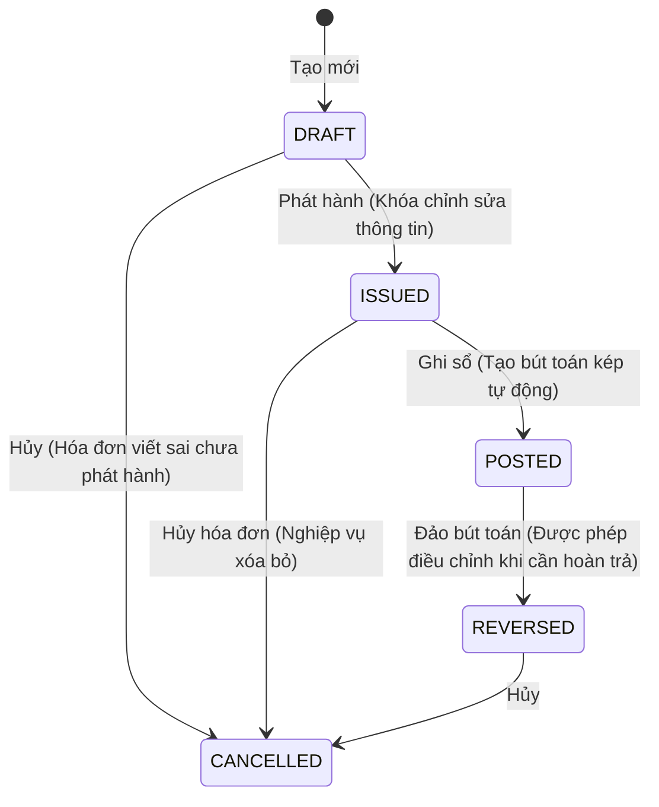

# TÀI LIỆU THIẾT KẾ PHÂN HỆ THUẾ & HÓA ĐƠN VAT - CONSTRUCTION ERP
## THIẾT KẾ MÔ HÌNH DỮ LIỆU, VÒNG ĐỜI VÀ NGUYÊN TẮC HẠCH TOÁN THUẾ GTGT

> [!NOTE]
> Tài liệu này thiết lập giải pháp kỹ thuật, kiến trúc dữ liệu và quy trình nghiệp vụ cho Sprint 3.2: VAT / Tax Gap.

---

### A. MÔ HÌNH DỮ LIỆU THUẾ (TAX DATA MODEL)

Để đảm bảo tính độc lập và không phá vỡ cấu trúc của các bảng dữ liệu cũ (`Invoice` bán lẻ, `CostRecord`), chúng ta bổ sung mô hình **`TaxInvoice` (Sổ Đăng Ký Hóa Đơn Thuế)** và 2 enum đi kèm:

```prisma
enum TaxInvoiceType {
  OUTBOUND // Hóa đơn bán ra (Output VAT)
  INBOUND  // Hóa đơn mua vào (Input VAT)
}

enum TaxInvoiceStatus {
  DRAFT     // Đang lập hóa đơn
  ISSUED    // Đã phát hành (chưa ghi sổ)
  POSTED    // Đã ghi sổ kế toán (Đã tạo bút toán JournalEntry)
  CANCELLED // Đã hủy hóa đơn
  REVERSED  // Đã đảo bút toán ghi sổ
}

model TaxInvoice {
  id                   String           @id @default(uuid())
  companyId            String?
  projectId            String?
  contractId           String?
  wbsId                String?
  invoiceType          TaxInvoiceType
  invoiceNumber        String           // Số hóa đơn (7 chữ số)
  invoiceSeries        String           // Ký hiệu hóa đơn (ví dụ: C26TBB)
  invoiceTemplate      String           @default("1C26TBB") // Mẫu số hóa đơn
  invoiceDate          DateTime         @default(now())     // Ngày hóa đơn GTGT
  partnerName          String           // Tên khách hàng / nhà cung cấp
  partnerTaxCode       String           // Mã số thuế đối tác
  partnerAddress       String?          // Địa chỉ đăng ký thuế đối tác
  netAmount            Decimal          @db.Decimal(18, 2)  // Giá trị trước thuế
  vatRate              Decimal          @db.Decimal(5, 2) @default(10) // Thuế suất (0, 5, 8, 10)
  vatAmount            Decimal          @db.Decimal(18, 2)  // Tiền thuế GTGT
  grossAmount          Decimal          @db.Decimal(18, 2)  // Tổng cộng (Gross = Net + VAT)
  status               TaxInvoiceStatus @default(DRAFT)
  description          String?          // Nội dung hóa đơn (nội dung cung cấp hàng hóa dịch vụ)
  sourceType           String?          // "INVOICE" hoặc "COST_RECORD"
  sourceId             String?          // ID thực thể nguồn để đối chiếu
  postedJournalEntryId String?          // ID bút toán ghi sổ cái (Double-Entry Ledger Link)
  deletedAt            DateTime?
  createdAt            DateTime         @default(now())
  updatedAt            DateTime         @updatedAt

  company              Company?         @relation(fields: [companyId], references: [id])
  project              Project?         @relation(fields: [projectId], references: [id])
  wbs                  WBSItem?         @relation(fields: [wbsId], references: [id])
  contract             Contract?        @relation(fields: [contractId], references: [id])

  @@unique([companyId, invoiceType, invoiceNumber, invoiceSeries, deletedAt])
  @@index([companyId])
  @@index([projectId])
  @@index([invoiceType])
  @@index([status])
  @@index([invoiceDate])
}
```

---

### B. VÒNG ĐỜI HÓA ĐƠN VAT (TAX INVOICE LIFECYCLE)

Quy trình trạng thái của Hóa đơn VAT tuân thủ nghiêm ngặt chuẩn mực kế toán kiểm toán:



*   **DRAFT (Đang lập)**: Cho phép sửa đổi toàn bộ thông tin (Số tiền, thuế suất, thông tin thuế).
*   **ISSUED (Đã phát hành)**: Khóa cứng toàn bộ thông tin giao dịch chính thức. Không được phép sửa đổi số tiền, MST hay thông tin thuế.
*   **POSTED (Đã ghi sổ)**: Hệ thống sinh bút toán kế toán kép vào Sổ cái thông qua `PostingEngine`. Trạng thái này là cơ sở để kết xuất dữ liệu lên Báo cáo Thuế và Báo cáo tài chính.
*   **REVERSED (Đã đảo)**: Thực hiện sinh bút toán ngược (âm hoặc đảo Nợ/Có) để hủy bỏ ảnh hưởng của Hóa đơn POSTED lên Sổ cái khi có sai sót phát hiện sau ghi sổ.

---

### C. NGUYÊN TẮC ĐỊNH KHOẢN TỰ ĐỘNG (POSTING RULES)

Khi thực hiện hành động **POST** Hóa đơn thuế, `TaxPostingEngine` tự động hạch toán dựa trên loại hóa đơn:

#### 1. Hóa đơn bán ra (OUTBOUND TaxInvoice)
*   **Mục đích**: Ghi nhận doanh thu xây dựng và thuế GTGT đầu ra phải nộp.
*   **Bút toán**:
    *   **Nợ TK 131** (Phải thu khách hàng): `grossAmount`
    *   **Có TK 511** (Doanh thu bán hàng và cung cấp dịch vụ): `netAmount`
    *   **Có TK 33311** (Thuế GTGT đầu ra): `vatAmount`

#### 2. Hóa đơn mua vào (INBOUND TaxInvoice)
*   **Mục đích**: Ghi nhận chi phí công trình/vật tư đầu vào và thuế GTGT đầu vào được khấu trừ.
*   **Bút toán**:
    *   **Nợ TK 621/627/642/152/156** (Tài khoản chi phí/vật tư tương ứng với CostRecord): `netAmount`
    *   **Nợ TK 1331** (Thuế GTGT đầu vào được khấu trừ): `vatAmount`
    *   **Có TK 331** (Phải trả nhà cung cấp) hoặc **111/112** (Tiền mặt/tiền gửi): `grossAmount`

---

### D. BÁO CÁO THUẾ VAT (VAT REPORTS)

Hệ thống kết xuất và tổng hợp dữ liệu thời gian thực:
1.  **Bảng kê hóa đơn bán ra (Sales VAT Book)**: Thống kê toàn bộ `OUTBOUND` hóa đơn có trạng thái `POSTED` trong kỳ thuế được chọn.
2.  **Bảng kê hóa đơn mua vào (Purchases VAT Book)**: Thống kê toàn bộ `INBOUND` hóa đơn có trạng thái `POSTED` trong kỳ thuế.
3.  **Tờ khai VAT nội bộ (VAT Declaration)**:
    *   Tổng doanh thu trước thuế & Tổng thuế bán ra (Tài khoản 33311).
    *   Tổng giá trị mua vào trước thuế & Tổng thuế mua vào được khấu trừ (Tài khoản 1331).
    *   Thuế GTGT phải nộp trong kỳ = Thuế bán ra - Thuế mua vào.

---

### E. QUY TẮC BẢO VỆ CHẶT CHẼ (TAX GUARD RULES)

1.  **Số hóa đơn duy nhất (Unique Constraint)**: Cấm lưu hóa đơn trùng cặp (Số hóa đơn - Ký hiệu - Loại hóa đơn) trên cùng một công ty nhằm chặn nhập trùng hóa đơn mua vào.
2.  **Khóa kỳ thuế (Fiscal Period Lock)**: Cấm lập, phát hành, hủy hoặc ghi sổ hóa đơn vào kỳ kế toán đã đóng (Closed period status).
3.  **Tính chính xác toán học (VAT Math Check)**: Số tiền thuế `vatAmount` phải khớp tuyệt đối bằng `netAmount * (vatRate / 100)`. Nếu có sai số lẻ do làm tròn, hệ thống cho phép ghi đè trong phạm vi dung sai tối đa **10 VNĐ**, nếu vượt quá bắt buộc phải nhập lý do giải trình (`overrideReason`).
4.  **Cách ly Tenant tuyệt đối (Tenant Isolation)**: Cấm truy vấn hoặc ghi chép hóa đơn chéo giữa các Company/Tenant.
5.  **Bảo vệ Trạng thái (Readonly Constraint)**: Cấm sửa hoặc xóa hóa đơn khi trạng thái đã chuyển sang `ISSUED`, `POSTED`, hoặc `CANCELLED`.
