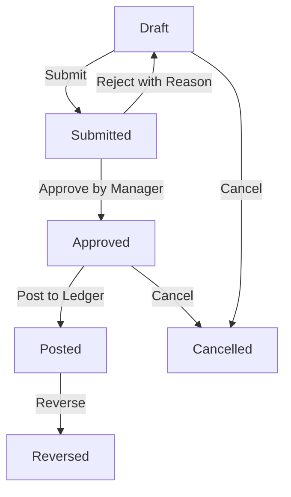

# PHASE 3.3: INVENTORY / WAREHOUSE / MATERIALS ARCHITECTURE & DESIGN
**Tài liệu Thiết kế Phân hệ Kho & Vật tư công trình - Construction ERP**

---

### I. CẤU TRÚC DỮ LIỆU (DATA MODEL DESIGN)

Chúng ta sẽ bổ sung 3 Enum và 6 Model sau vào Prisma Schema:

#### 1. Enums
* `InventoryDocumentType`:
  * `PURCHASE_RECEIPT` — Nhập mua từ nhà cung cấp.
  * `RETURN_RECEIPT` — Nhập trả lại từ công trình.
  * `ADJUSTMENT_IN` — Nhập điều chỉnh tăng.
  * `ISSUE_TO_PROJECT` — Xuất cho công trình.
  * `ISSUE_TO_COST` — Xuất cho chi phí.
  * `TRANSFER_OUT` — Xuất chuyển kho.
  * `TRANSFER_IN` — Nhập chuyển kho.
  * `ADJUSTMENT_OUT` — Xuất điều chỉnh giảm.
* `InventoryDocumentStatus`:
  * `DRAFT` — Bản nháp, sửa/xóa mềm tự do.
  * `SUBMITTED` — Chờ duyệt (nằm trong Inbox Phê duyệt tập trung).
  * `APPROVED` — Đã duyệt, sẵn sàng ghi sổ.
  * `POSTED` — Đã ghi sổ, bất biến, tạo Movement & Journal.
  * `REVERSED` — Đã đảo, tự động tạo Movement âm & Journal đảo.
  * `CANCELLED` — Hủy bỏ, chỉ áp dụng trước POSTED.
* `InventoryValuationMethod`:
  * `MOVING_AVERAGE` — Bình quân gia quyền di động (Moving Weighted Average) tức thời tại thời điểm Post.

#### 2. Models
* `MaterialItem`: Danh mục vật tư công trình.
* `Warehouse`: Danh mục kho bãi (kho tổng, kho công trình).
* `InventoryDocument`: Chứng từ kho (Phiếu nhập, Phiếu xuất, Chuyển kho).
* `InventoryDocumentLine`: Chi tiết mặt hàng trong chứng từ kho.
* `InventoryMovement`: Sổ nhật ký chi tiết xuất nhập kho (gốc cho Thẻ kho, Báo cáo nhập xuất tồn).
* `InventoryBalance`: Sổ tổng hợp tồn kho tức thời (Warehouse + Material + Project + WBS).

---

### II. NGUYÊN TẮC HẠCH TOÁN (POSTING RULES)

Khi một `InventoryDocument` chuyển sang trạng thái `POSTED`, hệ thống sẽ tự động sinh bút toán Sổ Cái (`JournalEntry`) cân đối kép theo các nguyên tắc kế toán Việt Nam:

#### 1. Nhập mua vật tư (`PURCHASE_RECEIPT`)
* Chưa thanh toán (hóa đơn công nợ):
  * **Nợ TK 152 / 153 / 156** (giá trị trước VAT)
  * **Nợ TK 1331** (tiền thuế VAT nếu có)
  * **Có TK 331** (Tổng thanh toán công nợ nhà cung cấp)
* Thanh toán ngay bằng tiền mặt/tiền gửi:
  * **Nợ TK 152 / 153 / 156**
  * **Nợ TK 1331**
  * **Có TK 111 / 112**

#### 2. Xuất vật tư cho công trình (`ISSUE_TO_PROJECT`)
* Phục vụ thi công trực tiếp công trình theo WBS:
  * **Nợ TK 621** (Chi phí nguyên vật liệu trực tiếp) hoặc **TK 627** (Chi phí sản xuất chung)
  * **Có TK 152 / 153 / 156**

#### 3. Chuyển kho nội bộ (`TRANSFER_OUT` / `TRANSFER_IN`)
* Cùng một pháp nhân công ty:
  * Tạo hai dòng chuyển đổi `InventoryMovement` (giảm kho nguồn, tăng kho đích).
  * Về mặt hạch toán kế toán:
    * **Nợ TK 152** (Kho đích)
    * **Có TK 152** (Kho nguồn)
    * Bút toán này tự cân Nợ/Có cùng tài khoản, bảo toàn tổng tài sản kho toàn công ty.

#### 4. Nhập / Xuất điều chỉnh (`ADJUSTMENT_IN` / `ADJUSTMENT_OUT`)
* Điều chỉnh tăng (thừa kho):
  * **Nợ TK 152 / 153 / 156**
  * **Có TK 3381** (Tài sản thừa chờ giải quyết)
* Điều chỉnh giảm (hao hụt kho):
  * **Nợ TK 632 / 1381** (Giá vốn hàng bán / Tài sản thiếu chờ xử lý)
  * **Có TK 152 / 153 / 156**

---

### III. THUẬT TOÁN TÍNH GIÁ XUẤT KHO (INVENTORY VALUATION)

Hệ thống áp dụng phương pháp **Bình quân gia quyền di động (Moving Weighted Average Cost)**:
* Mỗi lần Nhập kho (`POSTED` phiếu nhập):
  $$\text{Đơn giá bình quân mới} = \frac{\text{Giá trị tồn cũ} + \text{Giá trị nhập mới}}{\text{Số lượng tồn cũ} + \text{Số lượng nhập mới}}$$
* Mỗi lần Xuất kho (`POSTED` phiếu xuất):
  * Hệ thống lấy đơn giá bình quân tức thời trong `InventoryBalance` làm đơn giá xuất.
  * Nhân với số lượng xuất để tính thành tiền xuất.
  * Cập nhật số lượng và giá trị tồn giảm đi tương ứng.
* **Chốt chặn xuất âm kho**:
  * Nếu số lượng xuất vượt quá số lượng tồn hiện có trong kho tại thời điểm xuất: Hệ thống sẽ từ chối giao dịch (ném ra lỗi `NegativeStockError`) ngoại trừ trường hợp có quyền override được cấu hình.
  * Phép tính sử dụng thư viện `Decimal.js` để tránh sai số dấu phẩy động.

---

### IV. QUY TRÌNH PHÊ DUYỆT & TRUY VẾT (LIFECYCLE & TRACEABILITY)

* **Quy tắc bảo mật**:
  * Người tạo phiếu (`createdBy`) tuyệt đối **không được tự duyệt** chứng từ của mình (Segregation of Duties).
  * Kỳ kế toán đã khóa sổ (Period Lock) sẽ chặn đứng hoàn toàn mọi thao tác Post/Reverse/Update liên quan tới kho trong kỳ đó.
* **Mối quan hệ liên kết (Traceability)**:
  * Một phiếu kho `POSTED` sẽ liên kết trực tiếp với 1 `JournalEntry` hạch toán cân đối.
  * Từ màn hình Kho có thể drill-down xem trực tiếp bút toán Sổ Cái, Nhật ký di chuyển kho, và nhật ký vết thay đổi Audit Trail.
