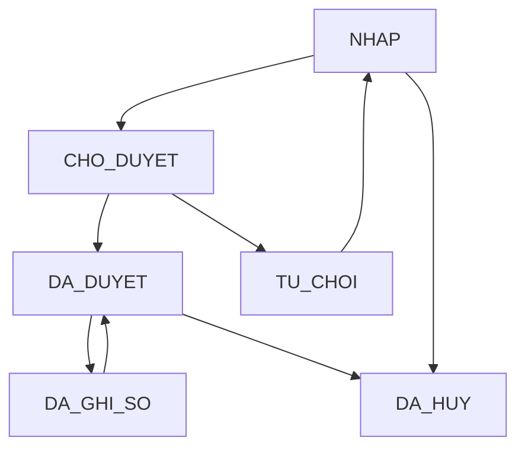

# Phase 4 Governance Report

Date: 2026-05-27

## Scope

Phase 4 adds an enterprise control layer for workflow, approval, permission matrix, document governance, audit trail, four-eyes control, payment approval thresholds, period governance, and role-based dashboard metadata.

No database schema, Prisma schema, accounting engine, ledger, trial balance, or accounting calculation logic was changed.

## Role Matrix

The application-level enterprise roles are mapped onto the existing `UserRole` enum to avoid database changes.

| Enterprise role | Existing role mapping |
| --- | --- |
| Ke toan cong no | `MANAGER` |
| Ke toan thanh toan | `BRANCH_DIRECTOR` |
| Ke toan tong hop | `ACCOUNTANT` |
| Ke toan truong | `CFO` |
| Giam doc | `GROUP_DIRECTOR` |
| Ban kiem soat | `AUDITOR` |
| Quan tri he thong | `ADMIN`, `SUPER_ADMIN` |

## Workflow Diagram



## Approval Flow

| Step | Control |
| --- | --- |
| Draft | Voucher starts as `NHAP`. |
| Submit | `NHAP -> CHO_DUYET` via submit endpoint. |
| Approve | `CHO_DUYET -> DA_DUYET`, requires approval permission. |
| Reject | `CHO_DUYET -> TU_CHOI`, requires approval permission. |
| Post | Only `DA_DUYET` vouchers can be posted. |
| Unpost | `DA_GHI_SO -> DA_DUYET`, preserving approval state. |

## Permission Matrix

Implemented in `lib/rbac.ts` as the single enterprise matrix. It covers:

`Create`, `Read`, `Update`, `Delete`, `Approve`, `Post`, `Unpost`, `Close Period`, `Open Period`, `Export`, `View Salary`, `View Profit`, `View Cash Flow`.

The matrix is module-aware for cost, revenue, invoice, voucher, payment, ledger, period, audit, report, project, dashboard, document, salary, profit, and cash flow.

## Document Governance

Posting checks required document types based on voucher/source type:

| Source type | Required documents |
| --- | --- |
| `PT`, `BC`, `PC` | Invoice, contract |
| `UNC`, `PAYMENT` | UNC, invoice, contract |
| `INVOICE` | Invoice, contract, acceptance minutes |

If required documents are missing, the voucher cannot be posted.

## Audit Trail

Voucher submit, approve, reject, post, and unpost actions write audit entries with:

User, action, entity, entity id, old value, new value, reason, severity, IP address, user agent, and correlation id when available.

## Security Findings

Fixed:

| Finding | Resolution |
| --- | --- |
| Old accounting guard treated create/update as report permissions. | `requireAccountingAccess` now validates report read/export only; workflow routes use module-specific permission checks. |
| Posting could happen without explicit approved-state gate. | `VoucherWorkflowGovernance.assertPostable` blocks non-approved vouchers. |
| Posting could happen without document dossier gate. | `DocumentGovernance.assertComplete` blocks missing required documents. |
| Creator self-approval risk. | `RBAC.assertSegregationOfDuties` is enforced during approval and posting evidence checks. |
| Unpost moved vouchers back to old draft-style state. | Unpost now returns to `DA_DUYET` to preserve approval evidence. |

## Test Results

Commands executed:

```bash
npx tsc --noEmit
npx tsx scripts/validation/phase4-governance-test.ts
npm run build
```

Results:

| Check | Result |
| --- | --- |
| TypeScript | PASS |
| Governance validation | PASS, 17/17 checks |
| 10 user / 7 role coverage | PASS |
| 100 voucher workflow simulation | PASS |
| Build | PASS |

The first sandboxed `tsx` and `next build` runs hit Windows `spawn EPERM`; both passed when rerun with approved execution outside the sandbox.

## Technical Debt

| Item | Status |
| --- | --- |
| Existing database enum still uses historical role names. | Intentional due no-schema-change constraint; mapped at application layer. |
| Existing `WorkflowEngine` remains available for legacy procurement/payment workflow concepts. | Not removed to avoid breaking existing logic. |
| Payment approval policies are code-configurable defaults, not database-configured thresholds. | Acceptable for Phase 4 without schema changes. |
| Build still emits existing Turbopack NFT warning from `next.config.ts -> generated/prisma-client -> app/api/revenues/[id]/route.ts`. | Existing warning, not introduced by Phase 4. |
