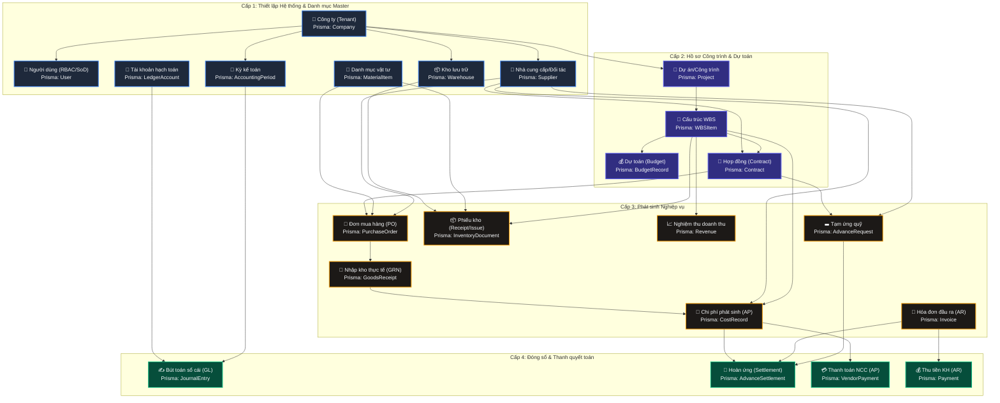

# BÁO CÁO KIỂM TOÁN DỮ LIỆU ĐẦU VÀO ERP XÂY DỰNG (EVIDENCE-BASED DATA AUDIT)
**Trạng thái:** HOÀN THÀNH (PHASE 2 - EVIDENCE-BASED AUDIT - CLEANED)  
**Chế độ hoạt động:** READ-ONLY SOURCE CODE AUDIT  

Báo cáo này được lập dựa trên việc đối chiếu trực tiếp giữa Giao diện người dùng (UI Forms), API DTOs (Zod Validations), cấu trúc Cơ sở dữ liệu (Prisma Schema), và các Quy tắc nghiệp vụ kiểm soát tài chính (Business Policies) trong mã nguồn hệ thống ERP. Tất cả dữ liệu giả lập/mẫu đã được loại bỏ và thay thế bằng các chỉ dẫn định dạng dữ liệu thực tế.

---

## 1. SƠ ĐỒ PHỤ THUỘC DỮ LIỆU & QUY TRÌNH HẠCH TOÁN (DATA DEPENDENCY WORKFLOW)

Để đảm bảo tính toàn vẹn dữ liệu và tránh các lỗi khóa ngoại (Foreign Key Constraints), lỗi hạch toán đơn, hoặc dữ liệu mồ côi (Orphan Records), dữ liệu thử nghiệm thực tế phải được nhập theo đúng thứ tự logic nghiệp vụ dưới đây:

---

## 2. FORENSIC MAPPING: TỪ GIAO DIỆN ĐẾN HẠCH TOÁN SỔ CÁI

Dưới đây là chi tiết kiểm toán từng thực thể dữ liệu đầu vào, đối chiếu trực tiếp giữa UI Forms, API DTOs (Zod), Schema DB và Quy tắc nghiệp vụ:

### 2.1. Dự án / Công trình (Project)
*   **UI Form:** `AddProjectModal.tsx`
*   **API Route:** `POST /api/projects`
*   **Zod Schema:** `createProjectSchema` (`lib/validations.ts`)
*   **Prisma Model:** `Project` (`prisma/schema.prisma` - Line 71)
*   **Bằng chứng kiểm toán kỹ thuật:**
    *   *Trường bắt buộc:*
        *   `name`: Tên dự án (Kiểu chuỗi `text`, tối đa 255 ký tự, không được để trống).
        *   `investor`: Chủ đầu tư/Pháp nhân giao dự án (Kiểu chuỗi `text`, tối đa 255 ký tự).
        *   `contractValue`: Giá trị hợp đồng gốc (Hệ thống map từ `totalValue` trong UI, kiểu số thực `Decimal/VND`, không được âm, mặc định là `0`).
    *   *Trường tùy chọn:*
        *   `description` (Tối đa 2000 ký tự), `projectType` (Tối đa 100 ký tự), `startDate` và `endDate` (Định dạng ngày `YYYY-MM-DD` hoặc ISO DateTime).
        *   `status`: Enum `ProjectStatus` (`PLANNED`, `IN_PROGRESS`, `ACTIVE`, `COMPLETED`, `CANCELLED`). Mặc định là `PLANNED` trên API, nhưng UI form mặc định chọn `IN_PROGRESS`.
    *   *Ràng buộc nghiệp vụ:* Tự động gán `companyId` từ Session User để phân quyền dữ liệu nội bộ (Multi-tenancy isolation).

---

### 2.2. Hạng mục Phân chia Công việc (WBS Item)
*   **UI Form:** `AddWBSModal.tsx`
*   **API Route:** `POST /api/wbs`
*   **Zod Schema:** `createWBSSchema` (`lib/validations.ts`)
*   **Prisma Model:** `WBSItem` (`prisma/schema.prisma` - Line 149)
*   **Bằng chứng kiểm toán kỹ thuật:**
    *   *Trường bắt buộc:*
        *   `projectId`: ID dự án (Định dạng UUID, bắt buộc).
        *   `name`: Tên hạng mục/công tác (Kiểu chuỗi `text`, tối đa 255 ký tự, không được để trống).
    *   *Trường tùy chọn:*
        *   `parentId`: ID hạng mục cấp cha (Định dạng UUID, có thể nhận `null` nếu là hạng mục gốc).
        *   `code`: Mã hạng mục tự định nghĩa (Kiểu chuỗi `text`, tối đa 50 ký tự).
        *   `sortOrder`: Thứ tự sắp xếp hiển thị trên cây WBS (Kiểu số nguyên `number`, mặc định là `0`).
    *   *Ràng buộc nghiệp vụ:*
        *   Trước khi cho phép xóa WBS, `services/wbs.service.ts` kiểm tra toàn bộ dữ liệu phát sinh liên kết (`CostRecord`, `BudgetRecord`, `ProgressEntry`, `Invoice`). Nếu tồn tại dữ liệu phát sinh, hệ thống chặn xóa để tránh lỗi tham chiếu và phân bổ "mồ côi" (Orphans).

---

### 2.3. Dự toán Ngân sách (Budget Record)
*   **UI Form:** `AddBudgetModal.tsx`
*   **API Route:** `POST /api/budgets`
*   **Zod Schema:** `createBudgetSchema` (`lib/validations.ts`)
*   **Prisma Model:** `BudgetRecord` (`prisma/schema.prisma` - Line 224)
*   **Bằng chứng kiểm toán kỹ thuật:**
    *   *Trường bắt buộc:*
        *   `projectId`: ID dự án (UUID).
        *   `wbsId`: ID hạng mục WBS (UUID).
        *   `costType`: Kiểu chi phí dự toán (Enum `CostType`: `material`, `labor`, `machine`, `subcontract`, `overhead`, `other`). Mặc định: `material`.
        *   `estimatedAmount`: Giá trị dự toán phê duyệt (Kiểu số thực `Decimal/VND`, phải lớn hơn `0`).
    *   *Trường tùy chọn:*
        *   `requestId`: Mã Idempotency chống gửi trùng lắp dữ liệu (Định dạng UUID).
    *   *Ràng buộc nghiệp vụ:*
        *   Mỗi cặp `(wbsId, costType)` chỉ được phép có một giá trị dự toán duy nhất trong một phiên bản ngân sách hoạt động (`BudgetVersion`) để tránh hạch toán đè dữ liệu.

---

### 2.4. Đơn mua hàng & Nghiệm thu Kho (PO & GRN)
*   **UI Form:** `InventoryDocumentForm.tsx` (Khi `documentType = "PURCHASE_RECEIPT"`)
*   **API Route:** `POST /api/inventory/documents`
*   **Zod Schema:** Hệ thống kiểm tra trực tiếp qua DTO nghiệp vụ trong `services/cost.service.ts` (3-Way Matching).
*   **Prisma Models:** `PurchaseOrder` (Line 416), `GoodsReceipt` (Line 460), `InventoryDocument` (Line 1904).
*   **Bằng chứng kiểm toán kỹ thuật:**
    *   *Quy tắc 3-Way Matching (Khớp 3 bên):*
        *   Được thực thi tại `services/cost.service.ts` (Phương thức `validate3WayMatch`).
        *   **Điều kiện 1:** Đơn mua hàng (PO) phải ở trạng thái đã phê duyệt (`status === "APPROVED"`).
        *   **Điều kiện 2:** Phải tồn tại phiếu nhập kho thực tế (GRN - Goods Receipt) tương ứng.
        *   **Điều kiện 3 (Dung sai):** Tổng giá trị thanh toán trên Hóa đơn/Cost Record không được vượt quá giá trị của đơn hàng gốc PO cộng thêm biên độ dung sai tối đa **5%** (`invoiceAmount <= PO.amount * 1.05`). Vượt quá tỷ lệ này hệ thống sẽ tự động chặn và ném lỗi nghiệp vụ.

---

### 2.5. Ghi nhận Chi phí phát sinh (Cost Record / AP Invoice)
*   **UI Form:** `AddCostModal.tsx`
*   **API Route:** `POST /api/costs`
*   **Zod Schema:** `createCostSchema` (`lib/validations.ts`)
*   **Prisma Model:** `CostRecord` (`prisma/schema.prisma` - Line 182)
*   **Bằng chứng kiểm toán kỹ thuật:**
    *   *Trường bắt buộc:*
        *   `projectId`: ID dự án (UUID).
        *   `wbsId`: ID hạng mục WBS (UUID).
        *   `amount`: Tổng giá trị chi phí trước thuế + giữ lại bảo hành (Kiểu số thực `Decimal/VND`, phải lớn hơn `0`).
    *   *Trường tùy chọn / Tính toán tự động:*
        *   `quantity` và `unitPrice`: Số lượng và đơn giá thực tế (Tự động nhân ra `amount = quantity * unitPrice`).
        *   `vatRate`: Thuế suất VAT (Kiểu số thực `number`, mặc định là `10`).
        *   `retentionRate`: Tỷ lệ giữ lại bảo hành công trình (Kiểu số thực `number`, mặc định là `0`).
        *   `netAmount` & `vatAmount`: Tự động tính toán trước khi đẩy vào db: `netAmount = amount / (1 + vatRate/100)`, `vatAmount = amount - netAmount`.
        *   `retentionAmount`: Số tiền bảo hành giữ lại: `amount * (retentionRate/100)`.
        *   `supplier`: Tên đơn vị thụ hưởng / Đội thi công (Kiểu chuỗi `text`, tối đa 255 ký tự).
        *   `date`: Ngày hạch toán phát sinh (Định dạng ngày `YYYY-MM-DD`, mặc định là ngày hiện tại).
    *   *Ràng buộc nghiệp vụ & Cảnh báo:*
        *   Hệ thống kiểm tra tổng giá trị chi phí phát sinh cộng dồn tại WBS đó với `BudgetRecord`. Nếu vượt dự toán chi phí đã duyệt, hệ thống ghi nhận log cảnh báo rủi ro vượt ngân sách (Cost Overrun warning) nhưng vẫn cho đi tiếp trừ khi có thiết lập quyền chặn cứng của từng tài khoản.

---

### 2.6. Quản lý Nhập/Xuất kho (Inventory Document)
*   **UI Form:** `InventoryDocumentForm.tsx` & `InventoryDocumentLinesTable.tsx`
*   **API Route:** `POST /api/inventory/documents`
*   **Prisma Model:** `InventoryDocument` (Line 1904) & `InventoryDocumentLine` (Line 1949)
*   **Bằng chứng kiểm toán kỹ thuật:**
    *   *Thông tin Header bắt buộc:*
        *   `documentNo`: Số phiếu kho (Kiểu chuỗi `text` duy nhất toàn hệ thống, tự động sinh theo mẫu `PK-xxxxxx` hoặc nhập tay dạng mã).
        *   `documentDate`: Ngày hạch toán kho (Kiểu ISO DateTime hoặc định dạng ngày `YYYY-MM-DD`).
        *   `documentType`: Loại nghiệp vụ kho (Nhận các giá trị: `PURCHASE_RECEIPT`, `ISSUE_TO_PROJECT`, `TRANSFER`, `ADJUSTMENT`).
    *   *Thông tin Lines (Mỗi dòng chi tiết vật tư):*
        *   `materialItemId`: ID vật tư trong danh mục (UUID, bắt buộc).
        *   `quantity`: Số lượng nhập/xuất (Kiểu số thực `number`, bắt buộc lớn hơn `0`).
        *   `unitCost`: Đơn giá vật tư (Bắt buộc nhập khi Nhập kho `PURCHASE_RECEIPT`, kiểu số thực `Decimal/VND`. **Không cần nhập khi Xuất kho** `ISSUE_TO_PROJECT`).
        *   `sourceWarehouseId`: ID kho xuất (UUID, bắt buộc nếu xuất kho hoặc điều chuyển kho).
        *   `targetWarehouseId`: ID kho nhận (UUID, bắt buộc nếu nhập kho hoặc điều chuyển kho).
    *   *Chính sách Quản lý Kho (Inventory Policy):*
        *   Được định nghĩa trong `lib/accounting/inventoryPolicy.ts`.
        *   **Không cho phép âm kho:** Phương thức `assertStockAvailable` sẽ truy vấn tồn kho khả dụng tại `InventoryBalance`. Nếu số lượng xuất kho lớn hơn số lượng tồn kho thực tế tại kho nguồn, hệ thống lập tức chặn giao dịch và báo lỗi: `"LỖI KHO: Số lượng xuất kho vượt quá số lượng tồn khả dụng..."`.
        *   **Giá xuất kho tự động:** Áp dụng phương pháp tính giá **Bình quan gia quyền di động (Moving Average Cost)**. Đơn giá xuất kho của từng dòng vật tư được tự động tính toán dựa trên số dư tồn kho và giá trị tồn tại thời điểm xuất, người dùng không thể tự nhập đơn giá xuất thủ công trên UI để bảo vệ tính toàn vẹn của Giá vốn hàng bán.

---

### 2.7. Hóa đơn tài chính & Thanh toán Công nợ (Invoices & Payments)
*   **UI Forms:** `AddInvoiceModal.tsx` (AR), `AddPaymentModal.tsx` (AR), `VendorPaymentModal.tsx` (AP)
*   **API Routes:** 
    *   Tạo Hóa đơn đầu ra: `POST /api/invoices` (Sử dụng Zod `createInvoiceSchema`)
    *   Tạo Thu tiền Khách hàng: `POST /api/payments` (Sử dụng Zod `createPaymentSchema`)
    *   Thanh toán nhà cung cấp: `POST /api/costs/[id]/payment` (Phương thức `createVendorPayment` trong `PaymentService`)
*   **Prisma Models:** `Invoice` (Line 262), `Payment` (Line 306), `VendorPayment` (Line 1473), `PaymentAllocation` (Line 1498)
*   **Bằng chứng kiểm toán kỹ thuật:**
    *   *Khống chế hạn mức thu nợ Khách hàng (AR):*
        *   Khi tạo chứng từ thu tiền, API validate số tiền thu thực tế `amount` không được phép lớn hơn số tiền còn lại của hóa đơn (`invoice.remainingAmount`). Nếu vi phạm, hệ thống ném lỗi: `"Số tiền thanh toán không được vượt quá số dư còn lại"`.
    *   *Khống chế hạn mức trả tiền Nhà cung cấp (AP):*
        *   Khi chi tiền từ quỹ trả NCC qua `VendorPaymentModal`, số tiền xuất quỹ `amount` không được lớn hơn tổng số nợ trên phiếu chi phí (`cost.amount`). Nếu cố tình nhập vượt, hệ thống sẽ throw error chặn cứng: `"LỖI KẾ TOÁN: Không được thanh toán vượt số tiền phải trả (Overpayment)"`.
    *   *Tự động Post Sổ cái:*
        *   Khi giao dịch thanh toán AP thành công, hệ thống tự động ghi nhận bút toán kép tương ứng vào Sổ cái thông qua `PostingEngine`:
            *   **Ghi Nợ (Dr) TK 3310:** Phải trả người bán (AP Account).
            *   **Ghi Có (Cr) TK 1020:** Tiền gửi ngân hàng (hoặc TK Tiền mặt thích hợp).

---

### 2.8. Tạm ứng & Hoàn ứng (Advances & Settlements)
*   **UI Form:** Tích hợp trong phân hệ Tạm ứng/Hoàn ứng (Workspace thanh toán của CFO).
*   **API Routes:**
    *   Tạo đề nghị tạm ứng: `POST /api/advances`
    *   Thực hiện hoàn ứng chi tiết: `POST /api/advances/[id]/settlements`
*   **Prisma Models:** `AdvanceRequest` (Line 1698), `AdvanceSettlement` (Line 1744).
*   **Bằng chứng kiểm toán nghiệp vụ (AdvanceSettlementPolicy):**
    *   *Ràng buộc khi Tạo Tạm ứng (`validateAdvanceCreate`):*
        *   Phải gắn với ít nhất một Dự án (`projectId`) hoặc Hợp đồng (`contractId`). Bỏ trống cả hai sẽ báo lỗi: `"LỖI NGHIỆP VỤ: Đề nghị tạm ứng phải gắn với Công trình hoặc Hợp đồng."`
        *   Phải chỉ định rõ đối tượng nhận tiền tạm ứng: hoặc Nhà cung cấp (`supplierId`) hoặc Nhân viên (`employeeId`). Thiếu cả hai sẽ báo lỗi: `"LỖI NGHIỆP VỤ: Đề nghị tạm ứng phải chỉ định rõ đối tượng nhận (Nhà cung cấp hoặc Nhân viên)."`
        *   Số tiền tạm ứng phải lớn hơn `0`.
    *   *Ràng buộc khi Duyệt Tạm ứng (`validateAdvanceApprove`):*
        *   Trạng thái chứng từ tạm ứng phải ở dạng `SUBMITTED`.
        *   **Nguyên tắc Bất kiêm nhiệm (Segregation of Duties - SoD):** Người lập đề xuất tạm ứng (`requestedBy`) tuyệt đối không được phép tự phê duyệt chứng từ này (`approvedBy === requestedBy`). Nếu vi phạm sẽ báo lỗi: `"LỖI NGHIỆP VỤ: Nguyên tắc SoD - Người tạo không được tự phê duyệt tạm ứng."`
    *   *Ràng buộc khi Hoàn ứng (`validateSettlement`):*
        *   Chứng từ tạm ứng gốc phải có trạng thái chi tiền thực tế là `PAID` hoặc `PARTIALLY_SETTLED`. Nếu không sẽ lỗi: `"LỖI NGHIỆP VỤ: Không thể hoàn ứng khi chứng từ tạm ứng chưa xuất tiền (PAID)."`
        *   Hóa đơn hoặc chi phí dùng để hoàn ứng phải đã được duyệt (Không được ở trạng thái `DRAFT`).
        *   Số tiền hoàn ứng thực tế (`settleAmount`) không được phép lớn hơn số dư tạm ứng còn lại (`advanceRemaining`) và không được lớn hơn số nợ còn lại của hóa đơn đối trừ (`invoiceRemaining`).
    *   *Ngăn chặn đối trừ chéo (`validateOffset`):*
        *   Không được phép đối trừ chéo giữa các công ty thành viên khác nhau (Cross-company offset). Nếu `companyId` của Tạm ứng và Hóa đơn khác nhau, hệ thống báo lỗi: `"LỖI NGHIỆP VỤ: Không được phép đối trừ chéo công ty (Cross-company)."`
        *   Không được đối trừ sai đối tượng (khác nhà cung cấp hoặc khác nhân viên nhận tạm ứng) trừ khi tài khoản có quyền ghi đè đặc biệt.

---

## 3. CƠ CHẾ AN TOÀN TÀI CHÍNH CỐT LÕI (FINANCIAL SAFETY SHIELDS)

Hệ thống ERP triển khai hai chốt chặn an toàn tài chính cực kỳ nghiêm ngặt tại tầng xử lý nghiệp vụ chung, bắt buộc phải có dữ liệu chuẩn bị tương ứng để thực hiện kiểm thử:

### 3.1. Khóa sổ Kỳ kế toán (Period Closing Lock)
*   **Tệp tin xử lý:** `services/finance/accounting-governance.ts` (Phương thức `assertPeriodIsOpen`)
*   **Nguyên tắc hoạt động:**
    1.  Khi có bất kỳ thao tác Thêm, Sửa, hoặc Xóa các chứng từ ảnh hưởng đến sổ sách kế toán (Vouchers, Invoices, Cost Records, Payments, Kho), hệ thống sẽ trích xuất tháng từ ngày hạch toán (dưới dạng định dạng `YYYY-MM`).
    2.  Hệ thống kiểm tra trong bảng `AccountingPeriod` trước. Nếu kỳ đó có trạng thái là `CLOSED`, hệ thống chặn đứng giao dịch và trả về thông báo lỗi chi tiết:
        > ⚠️ **Lỗi:** `"Kỳ kế toán [YYYY-MM] đã được khóa sổ bởi CFO. Mọi thao tác thêm/sửa/xóa chứng từ tài chính đều bị cấm. Vui lòng liên hệ CFO để mở lại kỳ nếu cần điều chỉnh."`
    3.  Nếu không có bản ghi mới, hệ thống dự phòng kiểm tra bảng legacy `FiscalPeriod`. Nếu cột `isLocked` là `true`, hệ thống báo lỗi:
        > ⚠️ **Lỗi:** `"Kỳ kế toán [YYYY-MM] đã bị khóa. Không thể thêm/sửa đổi/xóa dữ liệu tài chính trong kỳ này."`

---

### 3.2. Tính chất Bất biến của Sổ cái (Immutable Ledger Pattern)
*   **Tệp tin xử lý:** `services/finance/accounting-governance.ts` (Phương thức `assertNotDirectlyUpdatingLockedFields`) & `lib/accounting/postingEngine.ts`
*   **Nguyên tắc hoạt động:**
    *   Bút toán nào đã được chuyển sang trạng thái sổ cái là `POSTED` (Đã ghi sổ), `LOCKED` (Khóa sổ) hoặc `REVERSED` (Đã đảo) đều không thể cập nhật trực tiếp hoặc xóa bỏ khỏi cơ sở dữ liệu.
    *   Nếu cố tình gửi yêu cầu sửa đổi trực tiếp các bản ghi này, hệ thống sẽ ném lỗi:
        > ⚠️ **Lỗi:** `"Không thể thay đổi trạng thái của bản ghi đã được POSTED hoặc LOCKED. Vui lòng tạo bút toán đảo ngược (Reversal Entry)."`
    *   Quy trình sửa sai bắt buộc: Người dùng phải thực hiện chức năng **Đảo bút toán (Reverse Journal)** tại màn hình chứng từ. Hệ thống sẽ sinh thêm một chứng từ đảo ngược giá trị (định khoản ngược hoặc ghi số âm) để tự triệt tiêu số dư trên sổ cái, đảm bảo lịch sử kiểm toán (Audit Trail) không bao giờ bị đứt gãy.

---

## 4. KỊCH BẢN KIỂM THỬ UAT CHI TIẾT (HAPPY & UNHAPPY SCENARIOS)

Để nghiệm thu hệ thống trước khi vận hành thực tế, bộ phận QA và Kế toán trưởng cần chuẩn bị dữ liệu thực tế để chạy các kịch bản kiểm thử sau:

| Mã Kịch Bản | Phân Hệ | Tên Kịch Bản Kiểm Thử | Dữ liệu đầu vào cần chuẩn bị | Kết quả mong đợi (Hệ thống xử lý) |
| :--- | :--- | :--- | :--- | :--- |
| **UAT-01-OK** | Hệ thống | Khóa kỳ kế toán thành công | - 01 chứng từ thật phát sinh có ngày hạch toán cụ thể. - Kỳ kế toán tương ứng với tháng của chứng từ được chuyển trạng thái `CLOSED`. | Cho phép xem báo cáo. Chặn mọi hành vi thêm/sửa/xóa hóa đơn hoặc chi phí phát sinh trong tháng đó. Ném lỗi khóa sổ của CFO. |
| **UAT-02-ERR**| Kiểm soát | Vượt hạn mức 3-Way Match | - 01 PO thật đã được phê duyệt. - 01 Hóa đơn/Chi phí thật tham chiếu PO đó có giá trị vượt quá PO trên 5%. | Hệ thống báo lỗi chênh lệch vượt định mức và từ chối tạo Cost Record. |
| **UAT-03-ERR**| Bảo mật | Vi phạm bất kiêm nhiệm (SoD) | - 01 Chứng từ tạm ứng thật. - Tài khoản cố gắng duyệt trùng khớp với tài khoản người tạo đề xuất tạm ứng. | Hệ thống từ chối phê duyệt và báo lỗi vi phạm nguyên tắc SoD của CFO. |
| **UAT-04-OK** | Kho | Tính giá xuất Moving Average | - Tối thiểu 02 phiếu nhập kho thật của cùng một vật tư, phát sinh tại các thời điểm khác nhau, có số lượng và đơn giá thật. - 01 Phiếu xuất kho thật cho vật tư này. | Đơn giá xuất kho tự động tính theo giá bình quân gia quyền di động tại thời điểm xuất. Ghi nhận bút toán Nợ TK chi phí / Có TK 152 tương ứng giá trị bình quân. |
| **UAT-05-ERR**| Kho | Ngăn chặn xuất âm kho | - 01 Phiếu xuất kho thật với số lượng xuất lớn hơn số dư tồn khả dụng của vật tư tại kho nguồn trong hệ thống. | Hệ thống chặn giao dịch và báo lỗi tồn kho khả dụng không đủ. |
| **UAT-06-OK** | Kế toán | Đảo chứng từ (Reversal) | - 01 Hóa đơn đầu ra thật đã ở trạng thái hạch toán sổ cái (`status: "POSTED"`). | Chặn nút Xóa/Sửa trực tiếp. Khi thực hiện chức năng "Reverse", hệ thống tự động sinh bút toán đảo cân bằng tài khoản. |
| **UAT-07-ERR**| Tạm ứng | Hoàn ứng vượt số dư | - 01 Chứng từ tạm ứng thật đã thanh toán. - 01 Phiếu hoàn ứng đối trừ hóa đơn có giá trị lớn hơn số dư còn lại của tạm ứng đó. | Hệ thống báo lỗi số tiền hoàn vượt số dư tạm ứng khả dụng. |
| **UAT-08-ERR**| Tạm ứng | Đối trừ chéo công ty (Tenant) | - 01 Hóa đơn thuộc pháp nhân thật A. - 01 Chứng từ tạm ứng thuộc pháp nhân thật B. | Hệ thống chặn nghiệp vụ và báo lỗi không đối trừ chéo công ty. |
